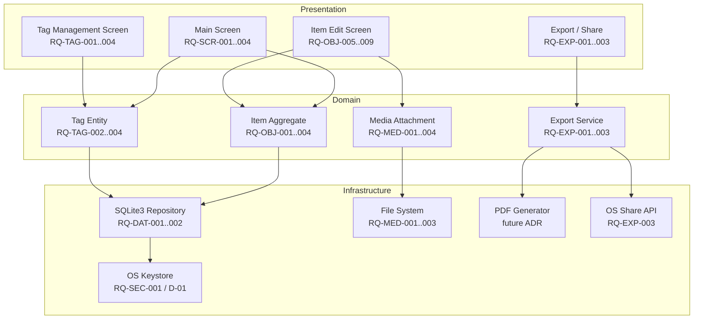

# ADR-001: Requirements Baseline and Key Design Decisions

- **Status:** Accepted
- **Date:** 2026-03-23
- **Deciders:** Project stakeholder, AI review
- **Requirement IDs affected:** RQ-OBJ-001 to RQ-OBJ-011, RQ-SCR-001 to RQ-SCR-004, RQ-MED-001 to RQ-MED-004, RQ-SEL-001 to RQ-SEL-003, RQ-TAG-001 to RQ-TAG-004, RQ-EXP-001 to RQ-EXP-003, RQ-NFR-001, RQ-DAT-001, RQ-DAT-002, RQ-SEC-001

---

## Context

During the initial AI-assisted review of the top-level requirements draft
(`top-level-requirements.draft.md`), several ambiguities, gaps, and
inconsistencies were identified. A set of architectural and design decisions
were made to resolve these issues and establish a stable baseline before
implementation begins.

---

## Decisions

### D-01: Encryption strategy -- transparent OS-keystore key (RQ-SEC-001)

**Decision:** The database encryption key is generated automatically per device
and stored in the OS keystore (Android Keystore / Windows DPAPI). No
authentication screen is shown to the user at launch.

**Rationale:**
- Removes friction from the user experience (no password to remember or lose).
- Encryption-at-rest is still enforced, satisfying the insurance justification
  use case's confidentiality needs.
- The alternative (application-level password) was explicitly rejected by the
  stakeholder during the requirements review session (2026-03-23).

**Consequences:**
- If the device is compromised (rooted/jailbroken), the keystore may be
  bypassed. This risk is accepted.
- Data cannot be recovered if the OS keystore is wiped (e.g., factory reset).
  A future backup/export requirement may need to address this.

---

### D-02: Custom item properties are per-item, not global (RQ-OBJ-003)

**Decision:** Custom key/value property keys belong exclusively to the item
they are defined on. Keys are not shared or suggested across items.

**Rationale:**
- Tags (RQ-OBJ-002) already cover the cross-item categorisation use case.
- Keeping custom property keys per-item simplifies the data model and avoids
  a global schema management problem.

**Consequences:**
- Users who want to use consistent custom properties across items must type
  the key name manually each time.
- A future improvement could add auto-completion from previously used keys
  without changing the underlying data model.

---

### D-03: Export and sharing capability added (RQ-EXP-001/002/003)

**Decision:** The application shall support PDF export, ZIP export (PDF +
media), and native OS sharing. This section was absent from the original draft.

**Rationale:**
- The primary stated purpose of the application is insurance justification.
  Without an export mechanism, the application cannot fulfil its core goal.
- PDF covers the human-readable report; ZIP covers the full evidence package.
- Native OS share covers delivery (email, messaging) without coupling the app
  to any specific service.

**Consequences:**
- A PDF generation library must be selected and justified in a subsequent ADR.
- The export feature must handle large item sets gracefully
  (pagination, progress indication).

---

### D-04: Camera availability handled at runtime (RQ-MED-002)

**Decision:** The "take a photo" option is hidden at runtime when no camera is
detected, rather than being statically disabled per platform.

**Rationale:**
- Windows devices may have USB or built-in cameras.
- A static Android-only restriction would exclude valid Windows use cases.
- Runtime detection is more resilient to hardware diversity.

---

### D-05: Tag deletion cascade -- silent removal after confirmation (RQ-TAG-004)

**Decision:** When a tag is deleted, it is silently removed from all items
that reference it after the user confirms the count of affected items.

**Rationale:**
- Blocking deletion if a tag is in use would leave orphaned tags if items are
  deleted between the check and the action.
- Requiring a replacement tag adds unnecessary friction.
- Showing the affected count before confirmation provides sufficient user
  awareness.

---

## Consequences Summary

| Decision | Risk | Mitigation |
|---|---|---|
| D-01: OS-keystore encryption | Data loss on factory reset | Document limitation; consider future export feature |
| D-02: Per-item property keys | Repetitive key entry | Future auto-complete from key history |
| D-03: Export / share | PDF lib dependency | Covered by future ADR on PDF library selection |
| D-04: Runtime camera detection | Camera detection errors on edge-case hardware | Graceful fallback to file-picker only |
| D-05: Tag deletion cascade | Accidental bulk removal | Confirmation dialog with affected item count |

---

## Architecture Overview

