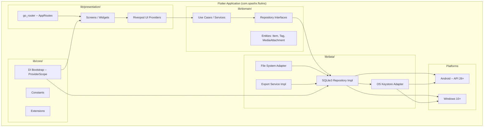

# ADR-002: Flutter Application Scaffold and Technology Stack

- **Status:** Accepted -- Implemented and verified 2026-03-25
- **Date:** 2026-03-23
- **Implemented:** 2026-03-25 (app confirmed running on Windows and Android)
- **Deciders:** Project stakeholder, AI review
- **Requirement IDs affected:** RQ-NFR-001

---

## Context

RQ-NFR-001 mandates that the system be implemented in Flutter targeting
Windows and Android as primary platforms. Before any code is written, the
following foundational choices must be locked down to ensure a consistent,
maintainable, and testable codebase:

- Flutter SDK version and channel
- State management solution
- Navigation / routing strategy
- Layered architecture pattern
- Dependency injection approach
- Minimum OS versions
- Application identity (name, package identifier)

All decisions in this ADR were validated with the project stakeholder on
2026-03-23 and are recorded here to prevent drift during implementation.

---

## Decisions

### D-06: Flutter stable channel, latest 3.x (RQ-NFR-001)

**Decision:** The project shall target the Flutter **stable** channel at its
latest 3.x release. No version pin is set at this stage; the pin will be
introduced in `pubspec.yaml` once the first working build is verified.

**Rationale:**
- Stable channel guarantees no breaking changes between minor updates
  during active development.
- Flutter 3.x introduced first-class Windows support, which is required
  by RQ-NFR-001.
- Using `>=3.0.0` in `pubspec.yaml` (environment constraint) is sufficient
  to prevent accidental use of a 2.x SDK.

**Consequences:**
- A `flutter.version` constraint must be added to `pubspec.yaml`.
- The CI/CD pipeline must pin its own Flutter SDK version to avoid
  unexpected breakage on update.

---

### D-07: Riverpod for state management and dependency injection (RQ-NFR-001)

**Decision:** The project shall use **Riverpod** (`flutter_riverpod`,
`riverpod_annotation`, `riverpod_generator`) for both reactive state
management and dependency injection throughout the application.

**Rationale:**
- Riverpod eliminates the `BuildContext` dependency required by Provider,
  making it usable in the domain and data layers.
- Code-generated providers (`@riverpod`) reduce boilerplate and enforce
  consistent provider patterns.
- A single DI mechanism reduces the conceptual surface area compared to
  combining a separate service locator (e.g. `get_it`) with a state
  manager.

**Consequences:**
- `build_runner` must be included as a `dev_dependency` for code generation.
- All provider files must be annotated and regenerated after changes.
- The team must understand the distinction between `@riverpod` (auto-dispose)
  and `@Riverpod(keepAlive: true)` for repository singletons.

---

### D-08: go_router for navigation (RQ-NFR-001)

**Decision:** The project shall use **go_router** for declarative, URL-based
navigation. Routes shall be defined in a single `router.dart` file under the
presentation layer.

**Rationale:**
- `go_router` is maintained by the Flutter team, reducing third-party
  dependency risk.
- Declarative route configuration aligns with the Clean Architecture
  principle of an explicit, inspectable navigation graph.
- Deep-linking readiness is provided at no extra cost, which may be needed
  for future share-target integration (RQ-EXP-003).

**Consequences:**
- All named routes must be declared as constants in a `AppRoutes` class.
- Shell routes shall be used for persistent navigation elements (e.g. app bar,
  bottom navigation if added later).

---

### D-09: Clean Architecture -- three-layer project structure (RQ-NFR-001)

**Decision:** The codebase shall be structured as three layers with strict
dependency rules:

| Layer | Folder | Dependency rule |
|---|---|---|
| Presentation | `lib/presentation/` | Depends on Domain only |
| Domain | `lib/domain/` | No dependency on Presentation or Data |
| Data | `lib/data/` | Depends on Domain only |

Cross-cutting concerns (constants, extensions, DI bootstrap) shall live in
`lib/core/`.

**Rationale:**
- Enforces testability: the Domain layer can be unit-tested without Flutter
  widgets or a database.
- Mirrors the architecture overview defined in ADR-001, with clear
  traceability to the domain aggregates and infrastructure components
  identified there.
- Facilitates parallel development across layers.

**Consequences:**
- Import direction must be enforced: Data and Presentation must NEVER import
  from each other.
- Repository interfaces are defined in Domain; implementations live in Data.
- A linting rule or CI check should verify the import direction
  (e.g. `dart_code_metrics` or a custom `analysis_options.yaml` rule).

---

### D-10: Minimum OS targets -- Android 8.0 (API 26) / Windows 10 (RQ-NFR-001)

**Decision:**
- **Android:** minimum SDK version = **26** (Android 8.0 Oreo).
- **Windows:** minimum version = **Windows 10** (build 1903 or later, which
  is the Flutter minimum).

**Rationale:**
- API 26 covers ~95% of active Android devices as of 2026-Q1.
- Android Keystore symmetric key generation (required by RQ-SEC-001 / D-01)
  is fully supported from API 23; API 26 gives headroom for other modern APIs.
- Windows 10 is the minimum supported by Flutter for Windows desktop.

**Consequences:**
- `android/app/build.gradle` must set `minSdkVersion 26`.
- No Android-only API below 26 may be used without a capability check.

---

### D-11: Application identity (RQ-NFR-001)

**Decision:**
- **Application name:** Flutins
- **Package identifier:** `com.spashx.flutins`
- **Android application ID:** `com.spashx.flutins`
- **Windows CLSID / app name:** `flutins`

**Rationale:**
- The package identifier was confirmed by the stakeholder on 2026-03-23 (corrected from `com.spash.flutins`).
- A consistent identifier across platforms avoids OS-level collisions.

**Consequences:**
- `flutter create` must be invoked with `--org com.spashx --project-name flutins`.
- The identifier must not be changed after the first install without a
  migration strategy, as it serves as the OS-level database and keystore anchor.

---

## Consequences Summary

| Decision | Risk | Mitigation |
|---|---|---|
| D-06: Flutter stable 3.x | SDK update breaks build | Pin SDK version in CI; test before upgrading |
| D-07: Riverpod DI + state | Code-gen overhead | Automate `build_runner` in watch mode during dev |
| D-08: go_router | Route refactor cost if deep-link shape changes | Centralise route constants in `AppRoutes` |
| D-09: Clean Architecture | Over-engineering for small team | Keep layers thin; skip abstractions until needed |
| D-10: API 26 / Win 10 min | Excludes older devices | Accepted; <5% of target market |
| D-11: com.spashx.flutins identity | Cannot rename post-install | Document; treat as immutable after first release |

---

## Architecture Overview

