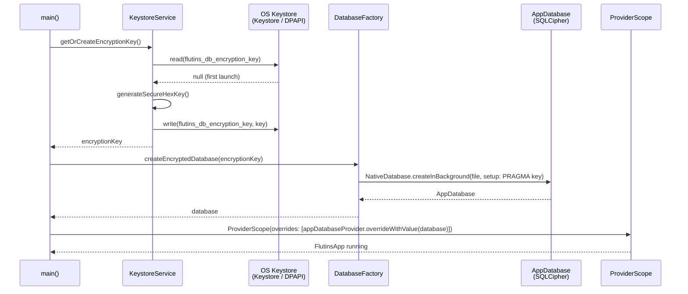
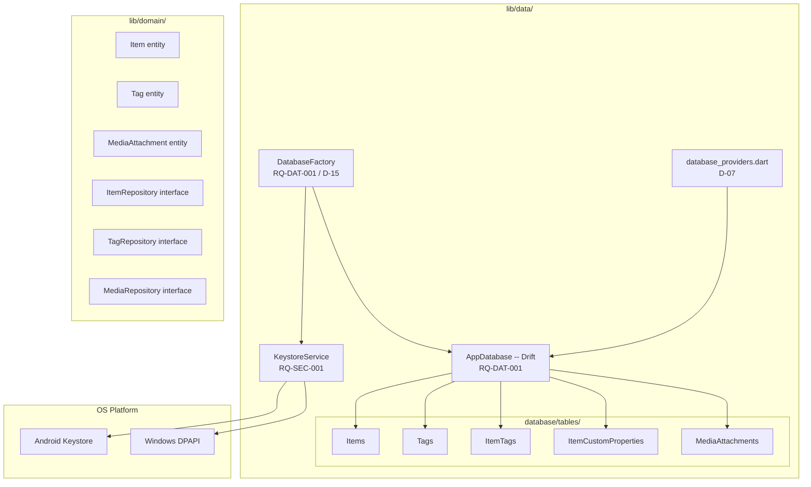

# ADR-003: Data Layer -- Drift + SQLCipher + OS Keystore

- **Status:** Accepted -- Implemented and verified 2026-03-25
- **Date:** 2026-03-25
- **Implemented:** 2026-03-25 (Drift + SQLCipher + KeystoreService in place, 19 tests passing)
- **Deciders:** Project stakeholder, AI review
- **Requirement IDs affected:** RQ-DAT-001, RQ-DAT-002, RQ-SEC-001

---

## Context

RQ-DAT-001 mandates a local SQLite3 database.
RQ-DAT-002 mandates that the database be encrypted by default.
RQ-SEC-001 mandates a device-specific, automatically generated encryption key
managed by the OS keystore -- no password prompt at launch.

The application targets Windows and Android (RQ-NFR-001), so every technology
choice must compile and work correctly on both platforms.

---

## Decisions

### D-12: Drift as the SQLite ORM (RQ-DAT-001)

**Decision:** The project shall use **Drift** (`drift`, `drift_dev`,
`drift/native.dart`) as the type-safe ORM over SQLite.

**Rationale:**
- Drift supports both Android (via `sqlite3`) and Windows (via FFI) with a
  single code path through `NativeDatabase`.
- Code-generated DAOs and table definitions enforce type safety at compile time.
- The `NativeDatabase.createInBackground` API isolates the database on a
  background isolate, keeping the UI responsive.
- `drift_dev` is already consistent with the `build_runner` pipeline that
  Riverpod code generation already uses (D-07).

**Consequences:**
- `drift` and `drift_dev` are added to `pubspec.yaml`.
- All table, DAO, and database classes must be re-generated after schema changes
  via `flutter pub run build_runner build --delete-conflicting-outputs`.
- Domain entities (pure Dart) are kept separate from Drift row types;
  mappers live in the data layer per D-09.

---

### D-13: SQLCipher for transparent database encryption (RQ-DAT-002)

**Decision:** The project shall use **SQLCipher** (via
`sqlcipher_flutter_libs`) as the SQLite engine, replacing the plain SQLite
binary for both Android and Windows.

**Rationale:**
- SQLCipher provides transparent AES-256 page-level encryption; no
  application code changes are required beyond `PRAGMA key`.
- `sqlcipher_flutter_libs` ships pre-compiled binaries for Android and
  Windows, removing the need to build C++ from source.
- Page-level encryption is superior to file-level encryption (e.g. encrypting
  the entire file with AES-CBC): partial reads remain secure and the journal
  file is also encrypted.

**Consequences:**
- `sqlcipher_flutter_libs` must be included in `pubspec.yaml`.
- `sqlite3_flutter_libs` must NOT be included; only one SQLite binary may be
  present in the dependency graph.
- The `PRAGMA key` must be applied in the `setup` callback before any other
  statement in `NativeDatabase.createInBackground`.

---

### D-14: flutter_secure_storage for OS keystore abstraction (RQ-SEC-001)

**Decision:** The project shall use **flutter_secure_storage** to generate,
persist, and retrieve the database encryption key using the device OS keystore.

**Rationale:**
- On Android, `flutter_secure_storage` uses Android Keystore, binding the
  encrypted secret to the device hardware and protecting against off-device
  extraction.
- On Windows, `flutter_secure_storage` uses DPAPI (Data Protection API),
  binding the secret to the Windows user account.
- Neither platform requires a user password, satisfying the "transparent"
  requirement of RQ-SEC-001.
- The 256-bit key is generated once using `dart:math` `Random.secure()`,
  stored in secure storage, and reused on every subsequent launch.

**Consequences:**
- `flutter_secure_storage` is added to `pubspec.yaml`.
- If the OS keystore entry is deleted (e.g. device wipe, account change), the
  key is lost and the database becomes unreadable. This is by design; a backup
  strategy is out of scope for the current release.
- `KeystoreService` is the single component responsible for key management;
  no other file may read or write the keystore entry.

---

### D-15: Database initialisation order in main() (RQ-DAT-001 / RQ-SEC-001)

**Decision:** The encrypted database shall be opened in `main()` before
`runApp()`. The resulting `AppDatabase` instance is injected into the Riverpod
`ProviderScope` via `appDatabaseProvider.overrideWithValue(...)`.

**Rationale:**
- Opening the database before `runApp()` guarantees that no widget tree frame
  is rendered while the database is unavailable, avoiding async-provider
  loading states for a fundamental infrastructure dependency.
- Using a `ProviderScope` override is idiomatic for injecting pre-constructed
  singletons in Riverpod (D-07), and allows tests to supply a mock instance.

**Consequences:**
- `main()` must be `async`.
- `WidgetsFlutterBinding.ensureInitialized()` must be called before any
  platform-channel call in `main()`.
- The widget test must override `appDatabaseProvider` with an in-memory
  `AppDatabase` if any screen under test accesses the database.

---

## Consequences Summary

| Decision | Risk | Mitigation |
|---|---|---|
| D-12: Drift ORM | Schema migration complexity as app grows | Version `schemaVersion` from day one; write migration steps |
| D-13: SQLCipher | PRAGMA key applied at wrong moment corrupts DB | Apply key as the first and only statement in the `setup` callback |
| D-14: flutter_secure_storage | Key loss = unreadable DB | Document; add backup/export requirement as separate RQ if needed |
| D-15: Sync DB init in main() | Slow startup if DB open is slow | Background isolate via `createInBackground` minimises main-thread cost |

---

## Architecture Overview

