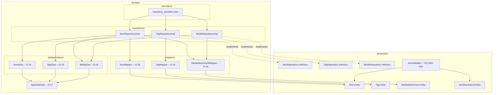

# ADR-004: Repository Implementation -- Drift DAOs and Mappers

- **Status:** Accepted -- Implemented and verified 2026-03-25
- **Date:** 2026-03-25
- **Implemented:** 2026-03-25 (3 DAOs, 3 mappers, 3 repository impls, ItemValidator, Riverpod providers; 41 tests passing)
- **Deciders:** Project stakeholder, AI review
- **Requirement IDs affected:** RQ-OBJ-001, RQ-OBJ-002, RQ-OBJ-003, RQ-OBJ-004, RQ-OBJ-010, RQ-TAG-002, RQ-TAG-003, RQ-TAG-004

---

## Context

ADR-003 established Drift as the ORM and defined the repository interfaces in
the domain layer. Before any screen can persist or retrieve items, the concrete
data-layer implementations of those interfaces must be built.

Three concerns must be addressed:

1. **DAO layer:** How do Drift query objects map to the repositories' operations?
2. **Mapper layer:** How do Drift row types (generated by the ORM) convert to and
   from pure domain entities without leaking Drift into the domain?
3. **Mandatory-field enforcement (RQ-OBJ-004):** Where should the rule
   "mandatory item properties cannot be removed during create/edit" live?

---

## Decisions

### D-16: Three Drift DAOs, one per aggregate responsibility (RQ-OBJ-001)

**Decision:** Three `@DriftAccessor` DAOs are created, each scoped to one
responsibility:

| DAO | Tables accessed | Responsibility |
|---|---|---|
| `ItemsDao` | `Items`, `ItemTags`, `ItemCustomProperties` | Item rows, tag associations, custom properties |
| `TagsDao` | `Tags`, `ItemTags` | Tag rows, item-count query |
| `MediaDao` | `MediaAttachments` | Media file references |

**Rationale:**
- Keeps each DAO small, focused, and independently testable.
- Avoids cross-DAO coupling at the SQL level while allowing the repository to
  compose multiple DAOs within a single transaction.
- Aligns with the single-responsibility principle from the project rules.

**Consequences:**
- `AppDatabase` references all three DAOs via `@DriftDatabase(daos: [...])`.
- `ItemRepositoryImpl` receives the `AppDatabase` (not individual DAOs) so it
  can open transactions that span `ItemsDao` operations atomically.
- Dart allows circular imports between `app_database.dart` and each DAO file;
  the Dart compiler handles this graph correctly.

---

### D-17: @DataClassName annotation to prevent row/entity name collisions (RQ-OBJ-001)

**Decision:** The three Drift tables whose generated row type would collide with
a domain entity are annotated with `@DataClassName`:

| Table | Generated class without annotation | Annotation applied | Generated row class |
|---|---|---|---|
| `Items` | `Item` (conflicts with `domain/entities/item.dart`) | `@DataClassName('ItemRow')` | `ItemRow` |
| `Tags` | `Tag` (conflicts with `domain/entities/tag.dart`) | `@DataClassName('TagRow')` | `TagRow` |
| `MediaAttachments` | `MediaAttachment` (conflicts) | `@DataClassName('MediaAttachmentRow')` | `MediaAttachmentRow` |

**Rationale:**
- Without this annotation, importing both the generated Drift types and the
  domain entities into the same file (e.g. a mapper) would cause a compile error.
- The `Row` suffix consistently signals "this is a persistence row type, not a
  domain entity".

**Consequences:**
- All mapper and DAO files that refer to row types use the `*Row` classes.
- This annotation is permanent; renaming later would require a coordinated update.

---

### D-18: Static mapper classes as the boundary between data and domain (RQ-OBJ-001)

**Decision:** Three abstract final mapper classes handle all conversion between
Drift row types and domain entities:

| Mapper | Converts |
|---|---|
| `ItemMapper` | `ItemRow` <-> `Item`, produces `ItemsCompanion` |
| `TagMapper` | `TagRow` <-> `Tag`, produces `TagsCompanion` |
| `MediaAttachmentMapper` | `MediaAttachmentRow` <-> `MediaAttachment`, produces `MediaAttachmentsCompanion` |

**Rationale:**
- Mappers are pure functions with no side effects -- easily unit-tested.
- Centralising conversion logic in a single class per entity means a column
  rename requires editing one file only.
- `abstract final class Mapper {}` (no constructor) signals that the class is
  a namespace for static methods, not an instantiable type.

**Consequences:**
- Mapper files live in `lib/data/mappers/` -- data layer only.
- Domain entities must remain free of any Drift import.

---

### D-19: ItemValidator in the domain layer for RQ-OBJ-004

**Decision:** A pure-Dart `ItemValidator` class in `lib/domain/validation/` is
the canonical source for:
- The set of mandatory item field identifiers (`ItemMandatoryFields`).
- A `validate(Item)` function that returns a `Map<String, String>` of
  field-name → error message.

The presentation layer uses `ItemValidator.validate(item)` to decide whether
the Save button is enabled, and `ItemMandatoryFields.isMandatory(field)` to
suppress the delete icon on mandatory form fields.

**Rationale:**
- Placing validation in the domain layer guarantees it can be unit-tested
  without Flutter or Drift.
- A single source of truth for "what is mandatory" prevents divergence between
  UI suppression logic and persistence validation.
- Returning a `Map<String, String>` is idiomatic for form validation in Flutter
  (matches `TextFormField.validator` expectations).

**Consequences:**
- The item create/edit form (RQ-OBJ-005 / RQ-OBJ-009) MUST consult
  `ItemValidator` before allowing save and before showing delete controls.
- Any new mandatory field requires only one change: `ItemMandatoryFields`.

---

## Consequences Summary

| Decision | Risk | Mitigation |
|---|---|---|
| D-16: Three DAOs | `saveItem` spans multiple DAOs -- transaction needed | Always call multi-DAO operations within `_db.transaction()` |
| D-17: @DataClassName | Code-generation must be re-run after table rename | Document in team conventions; part of standard `build_runner` cycle |
| D-18: Static mappers | Timestamp TZ assumptions baked into mapper | Store and restore as UTC milliseconds; document in mapper code |
| D-19: ItemValidator in Domain | Validator may diverge from UI expectations | UI must always call validator; never duplicate validation logic |

---

## Architecture Overview

