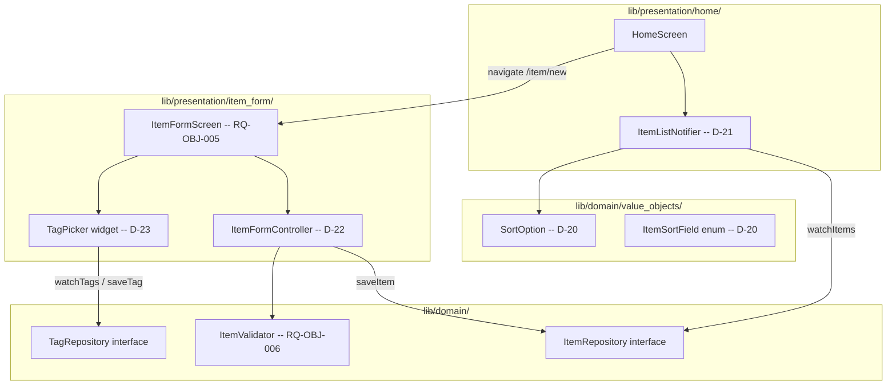

# ADR-005: Item Creation UI, Sort-Aware List State, and Tag Picker

- **Status:** Accepted -- Implemented and tested
- **Date:** 2026-03-25 (implemented 2026-03-26)
- **Deciders:** Project stakeholder, AI review
- **Requirement IDs affected:** RQ-OBJ-005, RQ-OBJ-006, RQ-OBJ-007, RQ-OBJ-008, RQ-SCR-001, RQ-SCR-002, RQ-SCR-003

---

## Context

The data layer (ADR-003 / ADR-004) is in place: items, tags, and media are
persisted, validated (ItemValidator), and exposed through typed repository
interfaces. The next deliverable is the presentation layer for item creation.

Four requirements must be addressed together because they share state:

- **RQ-OBJ-005** -- A creation form for all item properties.
- **RQ-OBJ-006** -- Mandatory-field validation gates the Save action.
- **RQ-OBJ-007** -- After save, the item appears at the correct position in the
  sorted list (requires a sort-aware list state shared between the home screen
  and the form's post-save navigation).
- **RQ-OBJ-008** -- The form lets the user pick an existing tag or create a new
  one inline.

---

## Decisions

### D-20: SortOption domain value object for RQ-OBJ-007 / RQ-SCR-002/003

**Decision:** A `SortOption` class (field + direction) and `ItemSortField` enum
live in `lib/domain/value_objects/sort_option.dart`. Sorting is applied in the
presentation provider, not in Drift queries, so the domain layer owns the
sort contract without any ORM dependency.

**Rationale:**
- Stream-based Drift queries do not re-sort automatically on field changes.
  A presentation-layer sort applied over `watchItems()` keeps the domain and
  data layers free of sort knowledge.
- Placing `SortOption` in the domain layer allows future use in export/filter
  requirements without referencing Flutter.

**Consequences:**
- `ItemListNotifier` (D-21) owns the current `SortOption` and exposes a
  `setSort` method.
- Default sort is `ItemSortField.name` ascending (RQ-SCR-003).

---

### D-21: ItemListNotifier -- Riverpod AsyncNotifier for the home item list

**Decision:** `ItemListNotifier` is a code-generated `@riverpod`
`AsyncNotifier<List<Item>>`. It watches `ItemRepository.watchItems()` and
applies the active `SortOption` before emitting.

**Rationale:**
- `AsyncNotifier` models the loading/data/error states that a stream-backed
  list naturally transitions through, without manual state management.
- Keeping sort logic in the notifier -- not the DB query -- lets the user
  change sort without reopening a database cursor.

**Consequences:**
- The notifier rebuilds the sorted list every time either the stream emits a
  new item set or `setSort` is called.
- `SortOption` is part of the notifier's state; reads are O(n log n) on each
  emission.

---

### D-22: ItemFormController -- Riverpod Notifier for draft item state

**Decision:** `ItemFormController` is a code-generated `@riverpod` `Notifier`
that manages the mutable draft state while the user fills in the creation form.
It exposes typed mutation methods (`setName`, `setCategory`, `setAcquisitionDate`,
`setSerialNumber`, `addTag`, `removeTag`, `setCustomProperty`, `removeCustomProperty`).

The `save()` method:  
1. Runs `ItemValidator.validate(draft)` -- aborts if invalid.  
2. Calls `ItemRepository.saveItem(draft)` via the injected provider.  
3. Returns a result sealed type (`ItemSaveSuccess` / `ItemSaveFailure`) so the
   UI can navigate or display an error without coupling to exceptions.

**Rationale:**
- A `Notifier` (synchronous build) is appropriate because the initial draft
  state is constructed synchronously from scratch (not loaded from a stream).
  For edit (RQ-OBJ-009) the notifier will be parameterised by item id.
- Exposing typed setters -- rather than a single `updateDraft(Item)` -- prevents
  the form from accidentally overwriting unrelated fields.

**Consequences:**
- `ItemFormController.errors` (a `Map<String, String>`) is derived live from the
  draft; the Save button reads `errors.isEmpty` (RQ-OBJ-006).
- The controller is auto-disposed: each form navigation creates a fresh draft
  and disposes it on pop, with no memory leak.

---

### D-23: TagPicker inline widget for RQ-OBJ-008

**Decision:** `TagPicker` is a stateless `ConsumerWidget` that:
- Watches `tagRepository` to show all existing tags as chips.
- Selected tags are highlighted; tapping toggles selection.
- A "New tag..." chip opens a small inline `AlertDialog` to create a tag inline.

**Rationale:**
- An inline dialog (rather than a full navigation push) keeps the user in the
  create/edit flow with no back-navigation needed.
- Watching the tag stream means a newly created tag appears immediately without
  manual refresh.

**Consequences:**
- Tag creation calls `TagRepository.saveTag(Tag(id: uuid.v4(), name: name))`.
- The dialog validates that the tag name is non-empty before allowing save.

---

## Consequences Summary

| Decision | Risk | Mitigation |
|---|---|---|
| D-20: Client-side sort | Re-sort on every stream emission (O(n log n)) | Acceptable for typical home catalogues (<10 000 items); revisit for large sets |
| D-21: AsyncNotifier | Error state must be surfaced to user | Form screen shows `SnackBar` on `ItemSaveFailure` |
| D-22: Typed setters | More boilerplate than a single `copyWith` call | Explicit API prevents hard-to-debug state drift |
| D-23: Inline tag creation | AlertDialog blocks form interaction | Intentional; keeps flow focused |

---

## Architecture Overview

