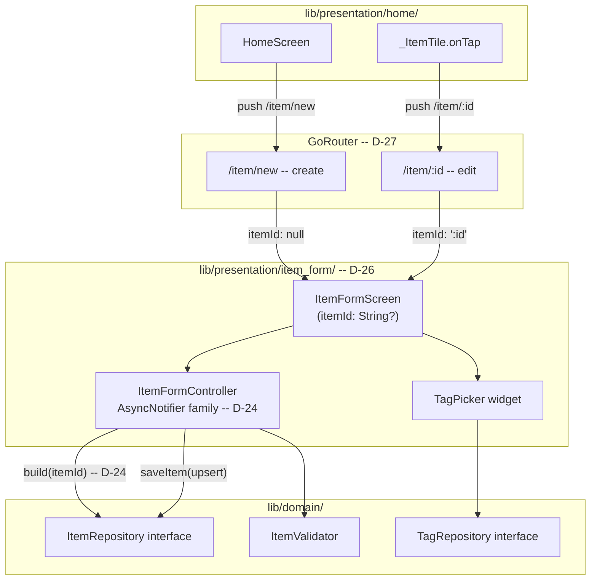
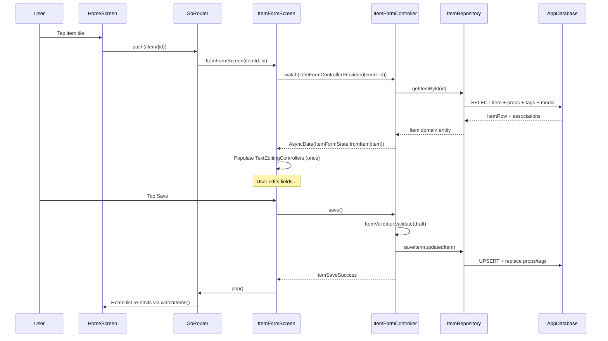

# ADR-006: Item Edit Screen -- Unified Form for Create and Edit

- **Status:** Accepted -- Implemented and tested
- **Date:** 2026-03-26
- **Deciders:** Project stakeholder, AI review
- **Requirement IDs affected:** RQ-OBJ-009

---

## Context

The item creation UI (ADR-005) is fully implemented and tested. The next
critical-path requirement is RQ-OBJ-009:

> "When the user taps an item in the list, the system shall display an edit
> screen allowing the user to modify all item properties."

The home screen already navigates to `AppRoutes.itemEdit` (`/item/:id`) on
tap (`HomeScreen._ItemTile`), but the GoRouter route is not yet registered and
no screen handles the edit path.

The creation form (`ItemFormScreen`) and its controller (`ItemFormController`)
share the exact same fields, validation rules, mutations, and save logic
needed for editing. The only differences are:

1. **Initial state** -- Edit pre-populates from an existing `Item`; create
   starts blank.
2. **App bar title** -- "Edit item" vs "Add item".
3. **Timestamp handling** -- Edit must preserve the original `createdAt` and
   only update `updatedAt`; create stamps both fresh.
4. **Loading state** -- Edit requires an async fetch from the repository before
   the form is interactive; create is synchronous.

### Alternatives Considered

| # | Alternative | Outcome |
|---|---|---|
| A | **Separate `EditItemFormController`** -- duplicate all mutations, validation, and save logic in a second controller | Rejected: massive code duplication violates SOLID (SRP is split across two identical controllers) and DRY |
| B | **Keep sync Notifier + `loadItem()` method** -- screen calls `loadItem()` on `initState()`; controller stays sync | Rejected: causes a brief blank-form flash before data arrives; screen must coordinate init timing; not idiomatic Riverpod |
| C | **AsyncNotifier family (chosen)** -- parameterised by `String? itemId`; `build()` loads from repo when editing | Accepted: idiomatic Riverpod pattern; single controller for both modes; proper loading/error states; family parameter enables DI |

---

## Decisions

### D-24: Promote ItemFormController to AsyncNotifier family

**Decision:** `ItemFormController` becomes a code-generated `@riverpod`
`AsyncNotifier` family, parameterised by `String? itemId`.

- When `itemId` is `null` (create mode): `build()` returns
  `ItemFormState()` synchronously -- no loading state.
- When `itemId` is non-null (edit mode): `build()` calls
  `ItemRepository.getItemById(itemId)` and returns
  `ItemFormState.fromItem(item)`.

All synchronous mutation methods (`setName`, `setCategory`, etc.) wrap
the updated state in `AsyncData(...)`:

```dart
void setName(String value) {
  final current = state.requireValue;
  state = AsyncData(current.copyWith(name: value));
}
```

Computed getters `errors` and `isValid` guard on `state.hasValue`:

```dart
Map<String, String> get errors =>
    state.hasValue
        ? ItemValidator.validate(state.requireValue.toItem())
        : const {};

bool get isValid => state.hasValue && errors.isEmpty;
```

**Rationale:**
- ADR-005 / D-22 already anticipated this: "For edit (RQ-OBJ-009) the notifier
  will be parameterised by item id."
- `AsyncNotifier` is the correct Riverpod primitive for a build phase that
  may perform I/O.
- Auto-dispose on the family provider means each edit navigation gets a
  fresh controller that reloads from the DB; no stale state leaks.
- The existing mutation API surface remains identical after a mechanical
  `state = X` to `state = AsyncData(X)` transform.

**Consequences:**
- All existing `ItemFormController` tests must update to unwrap `AsyncValue`.
- The screen wraps the form body in `state.when(loading:, error:, data:)`.
- Create mode is unaffected functionally: `build()` returns an immediate value
  wrapped in `AsyncData`, so no spinner is ever visible.

---

### D-25: ItemFormState.fromItem factory and createdAt preservation

**Decision:** Add a `ItemFormState.fromItem(Item item)` factory constructor
that maps all domain entity fields back into form state. Add an optional
`DateTime? createdAt` field to `ItemFormState`.

`toItem()` uses `createdAt ?? now` for the `createdAt` timestamp:
- **Create mode:** `createdAt` is null, so a fresh UTC timestamp is used.
- **Edit mode:** `createdAt` is set by `fromItem`, preserving the original value.

`updatedAt` is always stamped fresh.

**Rationale:**
- The repository's `saveItem()` is an upsert -- it works for both insert and
  update with no change needed (ADR-004 / D-16).
- Preserving `createdAt` requires carrying it through the form state; a
  dedicated field is the simplest, most explicit approach.

**Consequences:**
- `ItemFormState.copyWith` gains a `createdAt` parameter for completeness,
  but no mutation method modifies it -- it is immutable after construction.
- No repository or database schema changes are required.

---

### D-26: Unified ItemFormScreen for create and edit

**Decision:** `ItemFormScreen` gains a `String? itemId` constructor parameter.
The screen is reused for both modes:

- **Title:** `"Add item"` when `itemId == null`, `"Edit item"` otherwise.
- **Provider:** watches `itemFormControllerProvider(itemId: itemId)`.
- **Body:** wrapped in `asyncValue.when(loading:, error:, data:)`.
  Loading shows a `CircularProgressIndicator`; error shows a message.

The `TextEditingController`s are synchronised to the loaded form state
exactly once on first data emission (via `ref.listen` in `initState`
or a `didChangeDependencies` guard) to avoid cursor jumps during typing.

**Rationale:**
- The form fields, layout, validation, and save flow are identical for both
  modes -- a separate `EditItemFormScreen` would violate DRY.
- The `itemId` parameter naturally determines the mode; no boolean flags or
  enums are needed.

**Consequences:**
- The existing creation flow (`itemId: null`) is unchanged in behaviour.
- The edit flow (`itemId: 'abc'`) shows a loading spinner until the item is
  fetched, then displays the pre-populated form.

---

### D-27: GoRouter itemEdit route registration

**Decision:** Register a new `GoRoute` for `AppRoutes.itemEdit` (`/item/:id`)
in the router configuration. The route builder extracts `id` from
`GoRouterState.pathParameters` and passes it to `ItemFormScreen(itemId: id)`.

`AppRoutes.itemCreate` (`/item/new`) remains a separate route that passes
`itemId: null` to `ItemFormScreen`.

**Rationale:**
- `AppRoutes.itemEdit` and the navigation call in `_ItemTile.onTap` are already
  defined (ADR-002 / ADR-005). Only the GoRoute registration is missing.
- Keeping `/item/new` and `/item/:id` as separate routes avoids ambiguity
  (the literal `new` segment is matched before the `:id` parameter).

**Consequences:**
- Route ordering must place the `/item/new` route before `/item/:id` in the
  GoRouter list to prevent `new` from being captured as an ID.
- Deep-linking to `/item/<uuid>` is supported immediately.

---

## Consequences Summary

| Decision | Change scope | Risk | Mitigation |
|---|---|---|---|
| D-24: AsyncNotifier family | Controller + tests | Mechanical migration to `AsyncValue`; risk of missed unwrap | Compiler will flag type mismatches; run full test suite |
| D-25: fromItem + createdAt | ItemFormState | None -- additive | Field is immutable after construction |
| D-26: Unified form screen | ItemFormScreen, router | TextEditingController sync can cause cursor jumps | One-time sync on first data emission with a guard flag |
| D-27: Route registration | router.dart | `/item/new` vs `/item/:id` ordering | Place literal route before parameterised route |

---

## Architecture Overview



## Data Flow: Edit Mode


