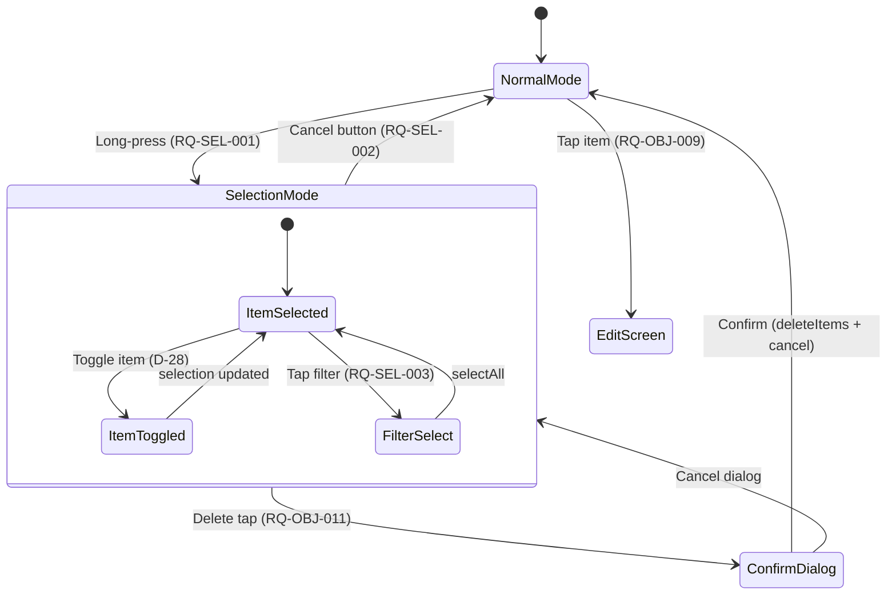

<!-- Model: Claude Opus 4.6 -->

# ADR-007: Multi-Selection Mode and Item Deletion Confirmation UI

- **Status:** Accepted -- Implemented and tested
- **Date:** 2026-03-29
- **Deciders:** Project stakeholder, AI review
- **Requirement IDs affected:** RQ-SEL-001, RQ-SEL-002, RQ-SEL-003, RQ-OBJ-010, RQ-OBJ-011

---

## Context

The data layer already supports batch item deletion via
`ItemRepository.deleteItems(List<String> ids)` (ADR-004 / D-16).
However the home screen (`HomeScreen`) currently provides **no way to select
items**: tapping an item navigates to the edit screen (RQ-OBJ-009), and there
is no long-press handler, no selection state, and no delete action exposed in
the UI.

Four pending requirements must be addressed together because they form a
single interaction flow:

| ID | Requirement |
|---|---|
| RQ-SEL-001 | Enter multi-selection mode on long-press |
| RQ-SEL-002 | Cancel button exits multi-selection mode and clears selections |
| RQ-SEL-003 | Filter mechanism to select all items matching criteria (e.g. tag) |
| RQ-OBJ-011 | Deletion confirmation dialog showing count before executing deletion |

RQ-OBJ-010 (delete one or more items) is already implemented at the data
layer but has no UI trigger -- multi-selection is the prerequisite.

### Platform consideration -- Windows

On Windows, a long-press gesture is emulated by a press-and-hold with the
mouse. Flutter's `GestureDetector.onLongPress` fires correctly on desktop for
this interaction. No platform-specific handling is required.

### Alternatives considered

| # | Alternative | Outcome |
|---|---|---|
| A | **Dedicated `SelectionNotifier` (Riverpod Notifier)** -- a separate notifier owns the `Set<String>` of selected item ids and the `bool inSelectionMode` flag. `ItemListNotifier` stays read-only. | Accepted |
| B | **Merge selection state into `ItemListNotifier`** -- add `selectedIds` and `inSelectionMode` fields to `ItemListState`. | Rejected: violates SRP -- sorting/streaming item data and tracking ephemeral UI selection are two distinct concerns. Mixing them causes unnecessary rebuilds of the list when selection changes. |
| C | **Local `StatefulWidget` state for selection** -- manage selection inside `_HomeScreenState`. | Rejected: makes unit testing difficult (widget test required); cannot be accessed from the AppBar actions without lifting state. |

---

## Decisions

### D-28: SelectionNotifier -- dedicated Riverpod Notifier for selection state (RQ-SEL-001 / RQ-SEL-002)

**Decision:** A new `@riverpod` synchronous `Notifier` class
`SelectionNotifier` in `lib/presentation/home/selection_notifier.dart` owns:

```dart
class SelectionState {
  const SelectionState({
    this.selectedIds = const {},
    this.isActive = false,
  });

  final Set<String> selectedIds;
  final bool isActive;
}
```

Public API:

| Method | Behaviour |
|---|---|
| `enterSelectionMode(String itemId)` | Sets `isActive = true`, adds `itemId` to `selectedIds` -- RQ-SEL-001. |
| `toggleItem(String itemId)` | Adds or removes `itemId`. If set becomes empty, exits selection mode automatically. |
| `selectAll(List<String> ids)` | Replaces `selectedIds` with the given set -- used by the filter-select feature (RQ-SEL-003). |
| `cancel()` | Clears `selectedIds`, sets `isActive = false` -- RQ-SEL-002. |

**Rationale:**
- Pure Notifier with no async I/O -- instant state transitions, easy to test.
- Separate from `ItemListNotifier` -- selecting an item does not trigger a
  list re-fetch or re-sort.
- The `Set<String>` representation allows O(1) lookup to render the checkbox
  state on each tile.

**Consequences:**
- `HomeScreen` must watch both `itemListNotifierProvider` and
  `selectionNotifierProvider`.
- Tile `onTap` must branch: if selection mode is active, toggle the item;
  otherwise navigate to edit.
- Tile `onLongPress` must call `enterSelectionMode(item.id)`.

---

### D-29: AppBar transforms during selection mode (RQ-SEL-002 / RQ-OBJ-011)

**Decision:** When `selectionState.isActive` is true, the `HomeScreen` AppBar
replaces the default title with `"N selected"` (where N is
`selectedIds.length`) and shows two action buttons:

| Position | Widget | Action |
|---|---|---|
| `leading` | Close / Cancel icon button | Calls `selectionNotifier.cancel()` -- RQ-SEL-002 |
| `actions[0]` | Delete icon button | Shows confirmation dialog (D-30) -- RQ-OBJ-011 |
| `actions[1]` | "Select all" / filter icon button | Opens filter-select bottom sheet (D-31) -- RQ-SEL-003 |

The AppBar background colour changes to `Theme.of(context).colorScheme.primaryContainer`
to give a clear visual signal that the screen is in selection mode.

**Rationale:**
- Standard Material 3 multi-selection pattern (Gmail, Google Photos, Files).
- Users immediately see how many items are selected and have a clear exit path.

**Consequences:**
- The `HomeScreen.build` method conditionally builds one of two `AppBar`
  configurations based on `selectionState.isActive`.
- The FAB (add item) should be hidden during selection mode to avoid accidental
  navigation.

---

### D-30: Deletion confirmation dialog with item count (RQ-OBJ-011)

**Decision:** When the user taps the delete action in the selection AppBar, a
`showDialog<bool>` is called displaying:

- Title: `"Delete items?"` (or `"Delete item?"` when count is 1).
- Content: `"N item(s) will be permanently deleted."` with the actual count.
- Actions: `Cancel` (returns false / null) and `Delete` (returns true).

When confirmed:
1. The list of selected ids is passed to `ItemRepository.deleteItems(ids)` --
   reusing the existing data layer (ADR-004 / RQ-OBJ-010).
2. `SelectionNotifier.cancel()` is called to exit selection mode.
3. The `ItemListNotifier` stream automatically emits the updated list (Drift
   stream query invalidation).

**Rationale:**
- Explicit count in the dialog prevents accidental mass deletion.
- Reuses the proven `deleteItems` API -- no new data-layer work.
- Cancel / Delete as the only actions follows the Material confirmation pattern;
  `Delete` uses `ColorScheme.error` for visual severity.

**Consequences:**
- A helper function `showDeleteConfirmationDialog(BuildContext, int count)`
  in `lib/presentation/home/widgets/` encapsulates the dialog to keep the
  screen widget clean.
- The count is read from `selectionState.selectedIds.length` at call time.

---

### D-31: Filter-select mechanism for batch selection by criteria (RQ-SEL-003)

**Decision:** A "Select by..." action in the selection AppBar opens a Material
bottom sheet listing:

| Filter | Effect |
|---|---|
| **Select all** | Selects every item currently in the sorted list. |
| **Select by tag** | Shows a sub-list of existing tags; selecting a tag adds all items with that tag to the selection. |
| **Select by category** | Shows a sub-list of distinct categories; selecting one adds all matching items. |

The bottom sheet calls `selectionNotifier.selectAll(matchingIds)` where
`matchingIds` is computed by filtering the current `ItemListState.items`
client-side (no extra DB query needed -- the full list is already in memory).

**Rationale:**
- Client-side filtering is sufficient: the item list is fully loaded into
  `ItemListState.items` by `ItemListNotifier` -- adding a server-side query
  would be premature.
- Bottom sheet is the standard Material pattern for contextual action lists.
- Extensible: new filter criteria (e.g. date range) can be added later by
  appending an entry to the bottom sheet.

**Consequences:**
- `SelectionNotifier.selectAll` must accept a `List<String>` (ids to select).
- The home screen must be able to read the current `ItemListState.items` to
  derive matching ids. It already watches `itemListNotifierProvider`, so no
  new dependency is needed.

---

## Consequences Summary

| Decision | Risk | Mitigation |
|---|---|---|
| D-28: Separate SelectionNotifier | Two providers to watch in HomeScreen | Both are lightweight; Riverpod selectors can minimise rebuilds |
| D-29: AppBar transformation | Increased build method complexity | Extract `_buildDefaultAppBar` and `_buildSelectionAppBar` helpers |
| D-30: Confirmation dialog | User might miss the count | Count is in the dialog body AND the AppBar title; two visibility points |
| D-31: Client-side filter-select | Slow on very large item lists (1000+) | Acceptable for personal inventory app; can add indexed queries later if needed |

---

## Interaction Flow



## Component Architecture

```mermaid
graph TD
    subgraph "lib/presentation/home/"
        HS[HomeScreen]
        AB_N["Default AppBar<br/>(title, FAB visible)"]
        AB_S["Selection AppBar -- D-29<br/>(count, Cancel, Delete, Filter)"]
        SN["SelectionNotifier -- D-28"]
        ILN["ItemListNotifier<br/>(existing)"]
        DCD["DeleteConfirmationDialog -- D-30"]
        FSB["FilterSelectBottomSheet -- D-31"]
    end

    subgraph "lib/domain/repositories/"
        IR["ItemRepository.deleteItems<br/>-- RQ-OBJ-010"]
    end

    HS -->|watches| SN
    HS -->|watches| ILN
    HS -->|"isActive = false"| AB_N
    HS -->|"isActive = true"| AB_S
    AB_S -->|"cancel()"| SN
    AB_S -->|"delete tap"| DCD
    AB_S -->|"filter tap"| FSB
    DCD -->|"confirmed"| IR
    DCD -->|"confirmed"| SN
    FSB -->|"selectAll(ids)"| SN
    HS -->|"onLongPress"| SN
    HS -->|"onTap in selection"| SN
