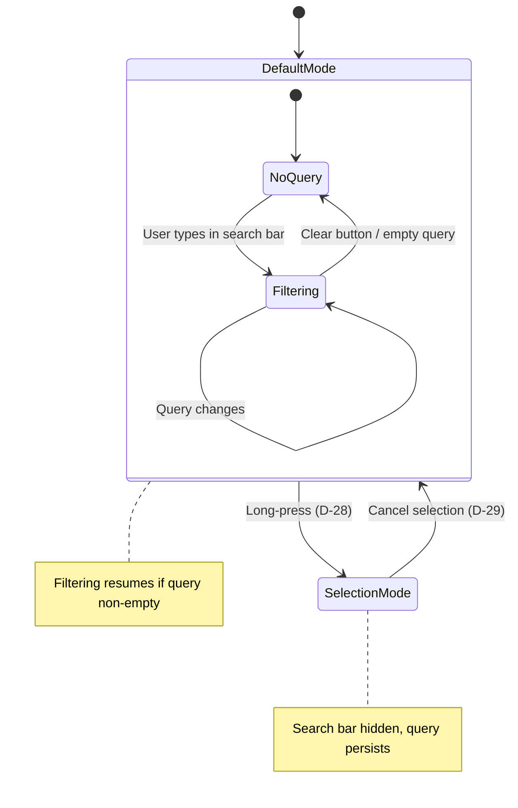
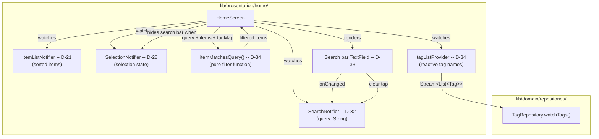
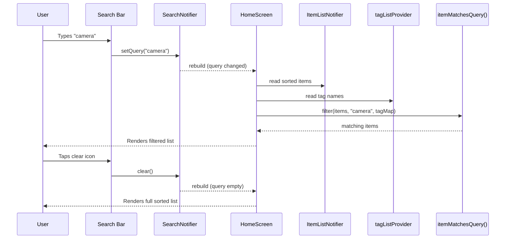

<!-- Model: Claude Opus 4.6 -->

# ADR-008: Text Search Bar on the Main Screen

- **Status:** Accepted -- Implemented and tested
- **Date:** 2026-03-29
- **Deciders:** Project stakeholder, AI review
- **Requirement IDs affected:** RQ-SCR-004

---

## Context

The home screen (`HomeScreen`) currently displays a sorted item list
(RQ-SCR-001 / RQ-SCR-003) and supports multi-selection for batch operations
(ADR-007). There is no mechanism to **filter** the displayed items by text.

### Requirement

> **RQ-SCR-004** -- The system shall display a text search bar on the main
> screen allowing the user to filter items by searching across all item
> properties or tags.

"All item properties" includes:

| Field | Type | Source |
|---|---|---|
| `name` | `String` | `Item.name` |
| `category` | `String` | `Item.category` |
| `serialNumber` | `String?` | `Item.serialNumber` |
| `customProperties` | `Map<String, String>` | keys AND values |
| tag names | `String` | resolved from `Item.tagIds` via `TagRepository` |

`acquisitionDate`, `createdAt`, and `updatedAt` are **excluded** -- date
fields have no meaningful free-text search representation and are better
served by a dedicated date-range filter in a future requirement.

### Existing architecture

- `ItemListNotifier` (D-21) exposes a stream of sorted items in
  `ItemListState`.
- `SelectionNotifier` (D-28) manages selection state; when active, the AppBar
  is replaced by selection controls (D-29).
- The full item list is already loaded in memory via the Drift stream query --
  no pagination or partial loading exists.
- Tags are stored separately; `Item` holds only `tagIds`. Tag names must be
  resolved from `TagRepository.watchTags()`.

### Alternatives considered

| # | Alternative | Outcome |
|---|---|---|
| A | **Dedicated `SearchNotifier` + client-side filtering in a pure function** -- search query lives in a separate Riverpod Notifier; filtering is a standalone testable function applied before rendering. | **Accepted** |
| B | **Extend `ItemListNotifier` with a search query field** -- add `query` to `ItemListState` and filter inside the notifier. | Rejected: violates SRP -- `ItemListNotifier` owns fetching and sorting; mixing in search filtering adds a second reason to change and couples search to the stream lifecycle. |
| C | **Server-side filtering via Drift custom query** -- push the search down to SQL `LIKE` clauses. | Rejected: the full list is already in memory; adding SQL complexity for a dataset of < 1000 items is premature. Also makes tag-name search harder (would require a JOIN). |
| D | **Merge search into `SelectionNotifier`** -- reuse the existing selection provider for query state. | Rejected: search and selection are orthogonal concerns; a user searches to find items, not to select them. Coupling would introduce confusing state transitions. |

---

## Decisions

### D-32: SearchNotifier -- dedicated Riverpod Notifier for search query state (RQ-SCR-004)

**Decision:** A new `@riverpod` synchronous `Notifier` class `SearchNotifier`
in `lib/presentation/home/search_notifier.dart` holds a single `String`
representing the active search query.

```dart
@riverpod
class SearchNotifier extends _$SearchNotifier {
  @override
  String build() => '';

  void setQuery(String query) => state = query;
  void clear() => state = '';
}
```

Public API:

| Method | Behaviour |
|---|---|
| `setQuery(String query)` | Replaces the search query; widgets rebuild and re-filter. |
| `clear()` | Resets query to empty string; full unfiltered list is shown. |

**Rationale:**
- Synchronous Notifier with no async I/O -- instant state updates.
- Separate from `ItemListNotifier` (SRP) -- the sorted list and the search
  query are independent concerns.
- Separate from `SelectionNotifier` -- searching and selecting are orthogonal
  user intents.

**Consequences:**
- `HomeScreen` must watch `searchNotifierProvider` in addition to
  `itemListNotifierProvider` and `selectionNotifierProvider`.
- When the query changes, the widget rebuilds and applies filtering before
  rendering.

---

### D-33: Search bar UI placement and interaction (RQ-SCR-004)

**Decision:** A `TextField` search bar is placed at the top of the `Scaffold`
body, above the `ListView`, inside a `Column`:

```
Scaffold
  appBar: (default or selection -- unchanged)
  body: Column
    [0] Padding > TextField    <-- search bar (D-33)
    [1] Expanded > ListView    <-- filtered item list
```

The `TextField` has:

| Element | Detail |
|---|---|
| Prefix icon | `Icons.search` |
| Suffix icon | `Icons.clear` -- visible only when query is non-empty; taps call `searchNotifier.clear()` |
| `onChanged` | Calls `searchNotifier.setQuery(value)` on every keystroke |
| Decoration | `OutlineInputBorder` with `InputDecoration.collapsed`-style, consistent with Material 3 |

**Interaction with selection mode (D-29):**

- When `selectionState.isActive` is `true`, the search bar is **hidden**
  (not rendered). The selection AppBar takes over the entire top area.
- The search query **persists** across selection mode transitions: if the user
  had typed a query, entered selection mode (clearing the search bar from
  view), and then cancelled selection, the previous query remains active and
  filtering resumes. This preserves the user's search context.

**Rationale:**
- The requirement says "display a text search bar" -- an always-visible bar
  (rather than hidden behind an icon) satisfies this directly.
- Placing the bar in the body rather than in `AppBar.bottom` avoids further
  complicating the already-conditional AppBar (default vs selection modes).
- No debouncing is needed: client-side filtering over < 1000 items is
  effectively instant, and adding a debounce timer would introduce perceived
  lag without benefit.

**Consequences:**
- The body layout changes from a flat `ListView` / empty-state to a `Column`
  with two children.
- The empty-state message ("No items yet...") must now account for two cases:
  (a) no items at all, (b) no items match the search query. A distinct
  "no results" message is shown when items exist but the filter produces an
  empty list.

---

### D-34: Client-side item filtering with tag name resolution (RQ-SCR-004)

**Decision:** A pure function `itemMatchesQuery` in
`lib/presentation/home/item_search_filter.dart` encapsulates all filtering
logic:

```dart
bool itemMatchesQuery(
  Item item,
  String lowerQuery,
  Map<String, String> tagNamesByIdLower,
) { ... }
```

The function checks whether `lowerQuery` is contained (case-insensitive) in
any of the following fields:

| Field | Match logic |
|---|---|
| `item.name` | `name.toLowerCase().contains(lowerQuery)` |
| `item.category` | `category.toLowerCase().contains(lowerQuery)` |
| `item.serialNumber` | `serialNumber?.toLowerCase().contains(lowerQuery)` |
| `item.customProperties` | Any **key** OR **value** `.toLowerCase().contains(lowerQuery)` |
| tag names | For each `tagId` in `item.tagIds`, check `tagNamesByIdLower[tagId]?.contains(lowerQuery)` |

**Tag name resolution** is provided by a lightweight `@riverpod` stream
provider:

```dart
@riverpod
Stream<List<Tag>> tagList(TagListRef ref) {
  return ref.watch(tagRepositoryProvider).watchTags();
}
```

This provider lives in `lib/presentation/home/tag_list_provider.dart`. The
`HomeScreen` watches it and builds a `Map<String, String>` (tag id to
lower-case name) before passing it to `itemMatchesQuery`.

**Integration in `HomeScreen.build()`:**

```
data: (state) {
  final query = ref.watch(searchNotifierProvider);
  final tags  = ref.watch(tagListProvider).valueOrNull ?? [];
  final tagMap = { for (t in tags) t.id : t.name.toLowerCase() };

  final displayItems = query.isEmpty
      ? state.items
      : state.items.where((i) => itemMatchesQuery(i, query.toLowerCase(), tagMap)).toList();

  // render displayItems (or "no results" if empty while state.items is not)
}
```

**Rationale:**
- Pure function with no side effects -- trivially unit-testable without
  `WidgetRef` or `ProviderContainer`.
- Client-side filtering is O(n * k) where n = item count and k = number
  of fields checked per item. For a personal inventory (< 1000 items) this
  is sub-millisecond.
- The `tagListProvider` reactively tracks tag renames: if a tag name changes,
  the search results update automatically via the Riverpod dependency graph.
- Extracting the function to a dedicated file keeps `home_screen.dart` focused
  on widget composition.

**Consequences:**
- A new file `item_search_filter.dart` with the pure filtering function.
- A new file `tag_list_provider.dart` with the tag stream provider.
- `HomeScreen` gains two new `ref.watch` calls (`searchNotifierProvider`,
  `tagListProvider`) -- still within reasonable rebuild scope since all three
  providers are lightweight.

---

## Consequences Summary

| Decision | Risk | Mitigation |
|---|---|---|
| D-32: Separate SearchNotifier | Third provider watched by HomeScreen | Each provider is lightweight; Riverpod minimises rebuild scope |
| D-33: Always-visible search bar | Takes vertical space on small screens | Single-line TextField is compact (~56dp); acceptable trade-off for instant discoverability |
| D-33: Search bar hidden during selection | User loses visual search context while selecting | Query persists; filtering resumes when selection exits |
| D-34: Client-side filtering | Slow on very large item lists | Sub-millisecond for < 1000 items; can move to SQL LIKE if needed later |
| D-34: Tag name resolution via provider | Extra provider + stream subscription | Reusable for future tag-related features; negligible overhead |

---

## Interaction Flow



## Component Architecture



## Data Flow -- Search Lifecycle


