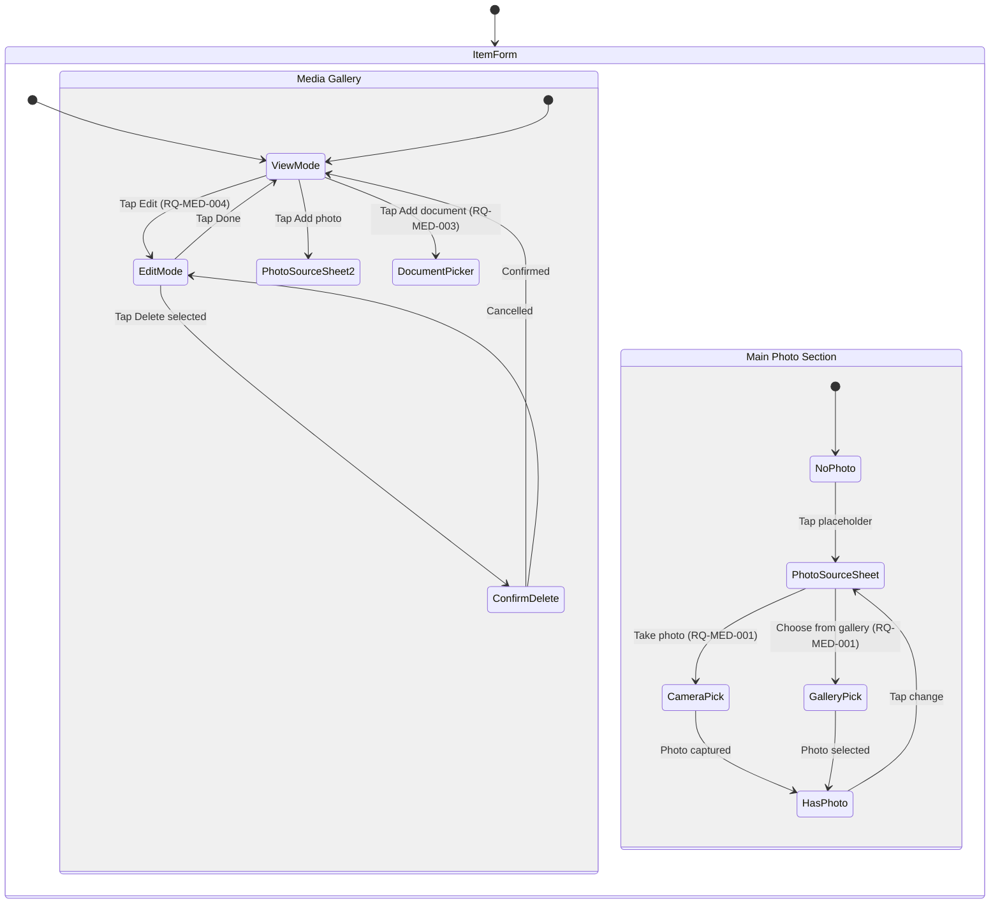
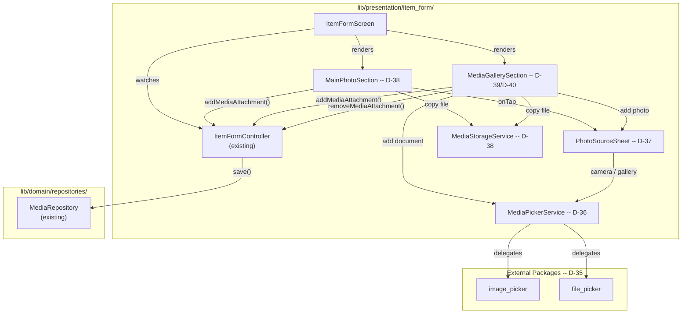
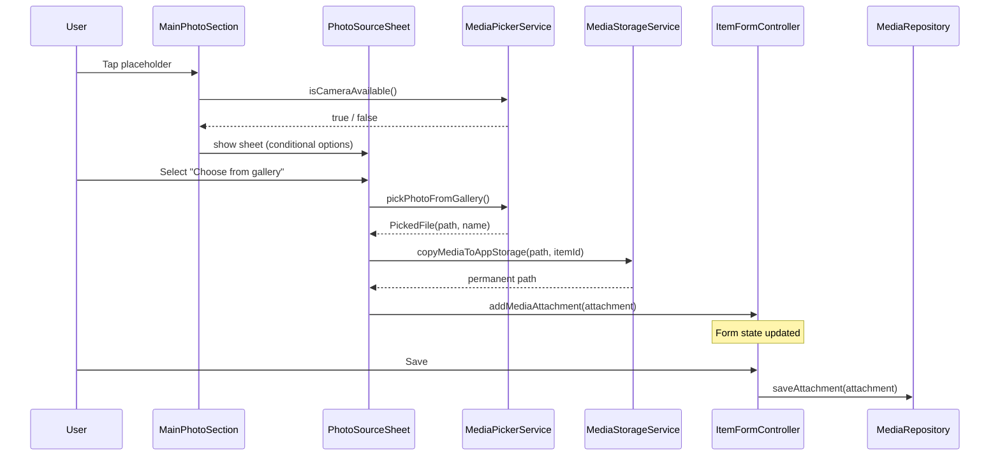

<!-- Model: Claude Opus 4.6 -->

# ADR-009: Media Picker and Gallery UI

- **Status:** Accepted -- Implemented and tested
- **Date:** 2026-03-29
- **Deciders:** Project stakeholder, AI review
- **Requirement IDs affected:** RQ-MED-001, RQ-MED-002, RQ-MED-003, RQ-MED-004

---

## Context

The data layer for media attachments is **fully implemented and tested**
(ADR-003 / ADR-004):

| Layer | Artifact | Status |
|---|---|---|
| Domain | `MediaAttachment` entity, `MediaType` enum | Complete |
| Domain | `MediaRepository` interface | Complete |
| Data | `MediaAttachments` Drift table, `MediaDao` | Complete |
| Data | `MediaAttachmentMapper` | Complete |
| Data | `MediaRepositoryImpl` | Complete |
| Presentation | `ItemFormController.addMediaAttachment()` / `removeMediaAttachment()` | Complete |
| Presentation | `_MainPhotoSection` placeholder (stub) | **TODO** -- replaced by this ADR |

Four pending requirements form a single interaction flow around capturing,
displaying, and managing media on the item form screen:

| ID | Requirement |
|---|---|
| RQ-MED-001 | Add photo via camera OR file system (defaulting to OS image directory) |
| RQ-MED-002 | Hide "take a photo" option when no camera is detected |
| RQ-MED-003 | Add document via file system only (defaulting to OS documents directory; no camera option) |
| RQ-MED-004 | Media gallery edit mode with checkboxes for deletion |

### Platform targets

- **Windows:** No built-in camera API in Flutter. The `image_picker` package
  delegates to file selection on desktop. Camera is never "detected" on
  Windows, so RQ-MED-002 naturally hides the camera option.
- **Android:** `image_picker` supports both camera and gallery intents.
  Camera availability is checked via `ImagePicker.supportsImageSource`.

### Package evaluation

| # | Package | Evaluation | Outcome |
|---|---|---|---|
| A | **`image_picker`** (first-party, flutter.dev) | Stable, maintained by Flutter team; supports camera + gallery on Android, file selection on Windows/desktop; `supportsImageSource(ImageSource.camera)` for RQ-MED-002. | **Accepted for photos** |
| B | **`file_picker`** (pub.dev) | Cross-platform file selection with directory defaults and extension filtering; supports documents (PDF, etc.) naturally. | **Accepted for documents** |
| C | **`image_picker` for documents** -- use image_picker for both photos and documents. | Rejected: image_picker filters for images; not suitable for arbitrary document types (PDF, DOCX). |
| D | **Build a custom platform channel** for camera + file picking. | Rejected: reinvents well-maintained packages; disproportionate effort. |

### Alternatives considered for gallery UI

| # | Alternative | Outcome |
|---|---|---|
| A | **Inline media gallery widget below the main photo section** with grid thumbnails, an add button, and an edit-mode toggle for deletion. | **Accepted** |
| B | **Separate full-screen gallery page** navigated from the form. | Rejected: breaks the single-form UX; user loses form context. |
| C | **Expandable bottom sheet gallery.** | Rejected: bottom sheet on desktop is awkward; inline is simpler and consistent. |

---

## Decisions

### D-35: Add `image_picker` and `file_picker` dependencies (RQ-MED-001 / RQ-MED-003)

**Decision:** Add two packages to `pubspec.yaml`:

```yaml
# D-35: Image picker -- camera and gallery for photos (RQ-MED-001)
image_picker: ^1.1.2

# D-35: File picker -- document selection from file system (RQ-MED-003)
file_picker: ^8.1.6
```

**Rationale:**
- `image_picker` is the Flutter team's official package for camera/gallery.
- `file_picker` is the de-facto standard for cross-platform file selection
  with extension filtering and initial directory support.
- Both are actively maintained with null-safe, platform-aware implementations.

**Consequences:**
- New transitive native dependencies on Android (activity result API) and
  Windows (file dialog COM interop).
- Android `AndroidManifest.xml` may need camera/storage permissions (handled
  by `image_picker` automatically via manifest merging).

---

### D-36: MediaPickerService -- abstraction over image/file picking (RQ-MED-001 / RQ-MED-002 / RQ-MED-003)

**Decision:** A new class `MediaPickerService` in
`lib/presentation/item_form/services/media_picker_service.dart` wraps
`ImagePicker` and `FilePicker` behind a testable interface:

```dart
abstract interface class MediaPickerService {
  /// Whether the device has a camera available -- RQ-MED-002.
  Future<bool> isCameraAvailable();

  /// Pick a photo from the device camera -- RQ-MED-001.
  Future<PickedFile?> pickPhotoFromCamera();

  /// Pick a photo from the file system -- RQ-MED-001.
  Future<PickedFile?> pickPhotoFromGallery();

  /// Pick a document file from the file system -- RQ-MED-003.
  Future<PickedFile?> pickDocument();
}

class PickedFile {
  const PickedFile({required this.fileName, required this.filePath});
  final String fileName;
  final String filePath;
}
```

A concrete `MediaPickerServiceImpl` implements this interface using
`ImagePicker` and `FilePicker`. A Riverpod provider exposes the singleton.

**Rationale:**
- Abstracts third-party packages behind an interface (Dependency Inversion).
- Enables unit testing of form logic without real file pickers.
- Centralises permission handling and error recovery.

**Consequences:**
- New file `media_picker_service.dart` with interface + implementation.
- New provider `mediaPickerServiceProvider` in
  `lib/presentation/item_form/services/`.
- `ItemFormScreen` consumes the service via `ref.read(mediaPickerServiceProvider)`.

---

### D-37: Photo source action sheet with camera detection (RQ-MED-001 / RQ-MED-002)

**Decision:** When the user taps "Add photo", a Material bottom sheet
(`showModalBottomSheet`) is displayed with up to two options:

| Option | Condition | Action |
|---|---|---|
| "Take a photo" (camera icon) | Shown **only when** `isCameraAvailable()` returns true -- RQ-MED-002 | Calls `pickPhotoFromCamera()` |
| "Choose from gallery" (image icon) | Always shown | Calls `pickPhotoFromGallery()` |

On Windows, `isCameraAvailable()` returns `false` (image_picker desktop
limitation), so only "Choose from gallery" appears -- naturally satisfying
RQ-MED-002 on desktop.

If only one option would be shown (camera unavailable), the bottom sheet is
**skipped** and the gallery picker opens directly -- no single-option menu.

**Rationale:**
- Bottom sheet with conditional options is the standard Material pattern
  (WhatsApp, Google Drive).
- Skipping the sheet when only one option exists eliminates a pointless tap.

**Consequences:**
- A helper function `showPhotoSourceSheet(context, service)` in
  `lib/presentation/item_form/widgets/photo_source_sheet.dart`.
- The main photo section and the gallery "add" button both call this function.

---

### D-38: Replace `_MainPhotoSection` stub with real picker (RQ-MED-001)

**Decision:** The existing `_MainPhotoSection` stub in `item_form_screen.dart`
is replaced by a new widget that:

1. When no main photo exists: shows the placeholder card (current design) but
   on tap opens the photo source sheet (D-37) instead of adding a stub.
2. When a main photo exists: shows a thumbnail of the actual image file
   (via `Image.file`) with a small "change" icon overlay.

The picked file is converted to a `MediaAttachment` with `isMainPhoto: true`
and passed to `notifier.addMediaAttachment()` (existing controller method).

**File copy strategy:** The picked file is copied from its temporary/original
location to the app's documents directory under
`media/<itemId>/<uuid>.<ext>`. This ensures the file persists independently
of the gallery/temp source. `path_provider` (already a dependency) provides
the app documents directory.

**Rationale:**
- Reuses the existing `addMediaAttachment` / `removeMediaAttachment` flow.
- Copying to app documents ensures the file survives gallery cleanup or
  temp directory purges.
- Thumbnail via `Image.file` is zero-dependency and works on all platforms.

**Consequences:**
- New utility function `copyMediaToAppStorage(String sourcePath, String itemId)`
  in `lib/presentation/item_form/services/media_storage_service.dart`.
- The `_MainPhotoSection` class is rewritten (not just edited).
- Existing tests that use the stub `MediaAttachment` with
  `filePath: 'stub/main.jpg'` remain valid -- the form controller does not
  care about the file path's existence.

---

### D-39: Media gallery grid with add buttons (RQ-MED-001 / RQ-MED-003)

**Decision:** A new `MediaGallerySection` widget in
`lib/presentation/item_form/widgets/media_gallery.dart` is placed in the form
below the main photo section. It displays:

```
[  Photo grid  ]  [ + Add photo ]
[  Doc list    ]  [ + Add document ]
```

**Photos sub-section:**
- A `GridView` of thumbnail images (3 columns) showing each non-main-photo
  attachment of type `photo`.
- An "Add photo" trailing card that opens the photo source sheet (D-37).

**Documents sub-section:**
- A `ListView` of document rows showing file name and an icon by extension.
- An "Add document" trailing button that calls `pickDocument()` from
  `MediaPickerService` (D-36) -- RQ-MED-003. No camera option is presented.

Both sub-sections call `notifier.addMediaAttachment(...)` with the
appropriate `MediaType` and `isMainPhoto: false`.

**Rationale:**
- Grid for photos is visually compact and natural for thumbnails.
- List for documents works better since documents have no meaningful thumbnail.
- Both sub-sections share the same `addMediaAttachment` / `removeMediaAttachment`
  controller methods.

**Consequences:**
- New file `media_gallery.dart` in `lib/presentation/item_form/widgets/`.
- `_buildForm` in `item_form_screen.dart` gains a `MediaGallerySection` widget
  between the main photo and tags sections.

---

### D-40: Gallery edit mode with checkboxes for batch deletion (RQ-MED-004)

**Decision:** The `MediaGallerySection` widget (D-39) has an "Edit" toggle
button in its header. When activated:

1. Each photo thumbnail and document row shows a `Checkbox`.
2. A "Delete selected" button appears (styled with `colorScheme.error`).
3. Tapping "Delete selected" shows a confirmation dialog (reusing the pattern
   from `showDeleteConfirmationDialog` -- D-30), then calls
   `notifier.removeMediaAttachment(id)` for each selected attachment.
4. The "Edit" button toggles back to "Done" to exit edit mode.

**State management:** Gallery edit mode is **local widget state**
(`StatefulWidget`) -- it is ephemeral UI state scoped to this section only,
not shared across the screen. No Riverpod notifier is needed.

**Main photo protection:** The main photo (where `isMainPhoto == true`) is
**excluded** from the gallery grid and cannot be selected for deletion via
this mechanism. The main photo has its own dedicated section (D-38) with a
"change" action rather than "delete", because the main photo is mandatory
(RQ-OBJ-001).

**Rationale:**
- Local `StatefulWidget` is appropriate for ephemeral toggle state that does
  not need to survive navigation or be read by other widgets.
- Reusing the confirmation dialog pattern (D-30) maintains consistency.
- Protecting the main photo from batch deletion enforces the mandatory-photo
  invariant at the UI level.

**Consequences:**
- `MediaGallerySection` is a `StatefulWidget` with `_isEditMode` and
  `_selectedIds` local state.
- The delete confirmation dialog function is moved to a shared location
  (`lib/presentation/shared/widgets/`) or imported from the home widgets
  directory (acceptable coupling since it is a generic confirmation dialog).

---

## Implementation Phases

### Phase 1 -- Photo and document picking (D-35, D-36, D-37, D-38)

**Scope:** Wire up real file/camera picking; replace the main photo stub;
add the gallery section with add-photo and add-document capabilities.

| Step | Artifact | Description |
|---|---|---|
| 1.1 | `pubspec.yaml` | Add `image_picker` and `file_picker` dependencies |
| 1.2 | `media_picker_service.dart` | Interface + implementation (D-36) |
| 1.3 | `media_storage_service.dart` | `copyMediaToAppStorage()` utility (D-38) |
| 1.4 | `photo_source_sheet.dart` | Bottom sheet with camera detection (D-37) |
| 1.5 | `item_form_screen.dart` | Replace `_MainPhotoSection` stub (D-38) |
| 1.6 | `media_gallery.dart` | Gallery grid + document list + add buttons (D-39) |
| 1.7 | `item_form_screen.dart` | Integrate `MediaGallerySection` into form |
| 1.8 | Tests | Unit tests for `MediaPickerService` (mock), `MediaStorageService` |
| 1.9 | Verify | `flutter analyze` + `flutter test` -- 0 issues, all green |

**Requirements covered:** RQ-MED-001, RQ-MED-002, RQ-MED-003

### Phase 2 -- Gallery edit mode with batch deletion (D-40)

**Scope:** Add edit-mode toggle, checkboxes, and batch deletion to the
gallery section.

| Step | Artifact | Description |
|---|---|---|
| 2.1 | `media_gallery.dart` | Convert to `StatefulWidget`, add edit toggle + checkboxes (D-40) |
| 2.2 | `delete_confirmation_dialog.dart` | Move to shared location or reuse existing |
| 2.3 | `media_gallery.dart` | Wire delete-selected action with confirmation dialog |
| 2.4 | Tests | Unit tests for gallery edit-mode state transitions |
| 2.5 | Verify | `flutter analyze` + `flutter test` -- 0 issues, all green |

**Requirements covered:** RQ-MED-004

---

## Consequences Summary

| Decision | Risk | Mitigation |
|---|---|---|
| D-35: Two new pub dependencies | Increased app size, potential breaking updates | Both are stable, widely used packages; pin versions |
| D-36: Service abstraction | Extra layer of indirection | Enables testability; interface is minimal (4 methods) |
| D-37: Conditional bottom sheet | Camera detection may fail | Graceful fallback: if detection fails, show file picker only |
| D-38: File copy to app storage | Disk space usage | Personal inventory app -- media count is bounded; acceptable |
| D-39: Inline gallery in form | Long form with many media | Grid is compact; form is already scrollable |
| D-40: Local StatefulWidget for edit mode | Edit state lost on rebuild | Acceptable: edit mode is brief and intentional; losing it on navigation is expected |

---

## Interaction Flow



## Component Architecture



## Data Flow -- Add Photo Lifecycle


