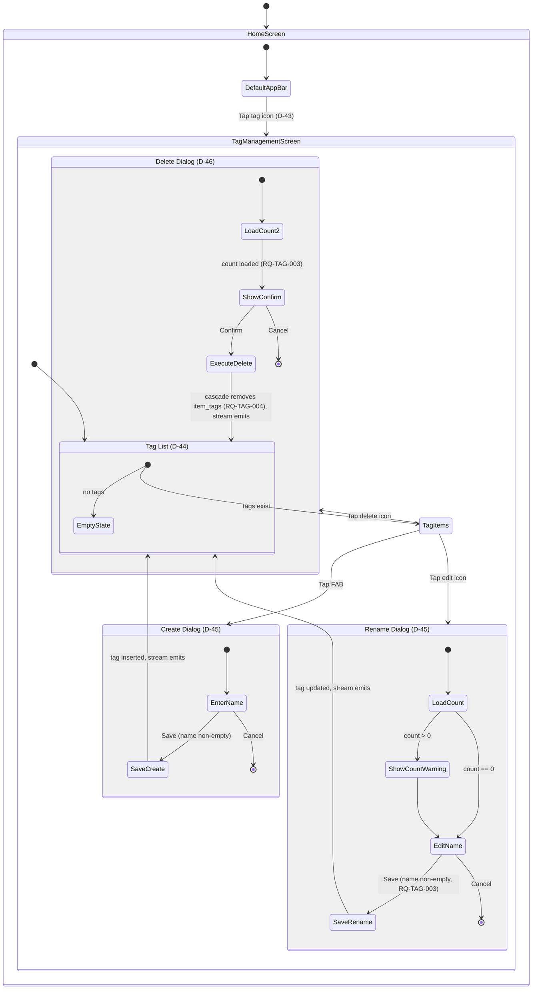
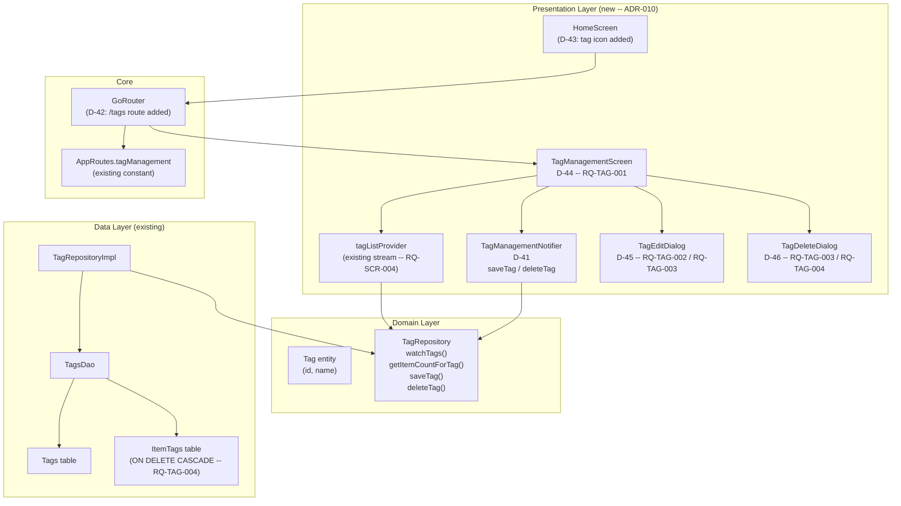

<!-- Model: Claude Sonnet 4.6 -->

# ADR-010: Tag Management Screen UI

- **Status:** Proposed
- **Date:** 2026-03-30
- **Deciders:** Project stakeholder, AI review
- **Requirement IDs affected:** RQ-TAG-001, RQ-TAG-002, RQ-TAG-003, RQ-TAG-004

---

## Context

The data layer for tags is **fully implemented and tested** (ADR-003 / ADR-004):

| Layer | Artifact | Status |
|---|---|---|
| Domain | `Tag` entity (id, name) | Complete |
| Domain | `TagRepository` interface (`watchTags`, `getItemCountForTag`, `saveTag`, `deleteTag`) | Complete |
| Data | `Tags` + `ItemTags` Drift tables (FK ON DELETE CASCADE -- RQ-TAG-004) | Complete |
| Data | `TagsDao` (CRUD + count query) | Complete |
| Data | `TagRepositoryImpl` | Complete |
| Presentation | `tagListProvider` (stream provider, used by home search -- RQ-SCR-004) | Complete |
| Core | `AppRoutes.tagManagement = '/tags'` constant (declared, unwired) | Partial |

Four requirements that form a single interaction surface remain pending
at the UI layer:

| ID | Requirement |
|---|---|
| RQ-TAG-001 | Provide a tag management screen listing all existing tags |
| RQ-TAG-002 | Full CRUD (create, read, update, delete) on tags |
| RQ-TAG-003 | Show number of affected items before modification or deletion |
| RQ-TAG-004 | Deletion cascades silently -- already enforced at DB level; confirmation UI required |

### Constraints

- RQ-TAG-004 is already satisfied at the database level via `ON DELETE CASCADE`
  on `item_tags.tag_id`. The UI must support it by showing a confirmation dialog
  (RQ-TAG-003) before calling `deleteTag()`, but performs no extra data work.
- `getItemCountForTag(String tagId)` already exists in `TagRepository` and
  `TagsDao` -- no data layer change required.
- The route constant `AppRoutes.tagManagement = '/tags'` is declared in
  `app_routes.dart` but is NOT yet registered in `GoRouter`. This is the only
  router-level change required.
- The `tagListProvider` stream provider already exists; it must NOT be
  duplicated or replaced.

### Alternatives considered

#### Navigation entry point into the tag management screen

| # | Alternative | Outcome |
|---|---|---|
| A | **AppBar icon action on HomeScreen** -- add a label/tag icon to the default AppBar (hidden during selection mode) | **Accepted** |
| B | **Navigation drawer** with a settings section | Rejected: introduces a global drawer pattern for which no other requirement exists; over-engineering for the current scope |
| C | **Second FAB (Extended FAB) on HomeScreen** | Rejected: Flutter does not support two `floatingActionButton` slots; the existing FAB is already reserved for "add item" (RQ-OBJ-005) |
| D | **Gesture-accessible entry from the item form tag chip area** | Rejected: the tag management screen is a standalone concern not scoped to item editing; buried entry point reduces discoverability |

#### Tag list item layout

| # | Alternative | Outcome |
|---|---|---|
| A | **`ListTile` with trailing edit + delete icon buttons** | **Accepted**: standard Material 3 pattern; each action is explicit and one tap away |
| B | **Swipe-to-delete (Dismissible) with long-press to rename** | Rejected: swipe-to-delete bypasses the confirmation requirement (RQ-TAG-003); gestures are not discoverable on desktop (Windows target) |
| C | **Contextual popup menu (three-dot) per tile** | Rejected: adds an extra tap compared to direct icon buttons; no advantage when only two actions exist |

#### Create / rename dialog

| # | Alternative | Outcome |
|---|---|---|
| A | **Modal `AlertDialog` with a single `TextField`** | **Accepted**: minimal surface, standard Material pattern, straightforward to unit-test |
| B | **Inline list tile editing (transforms tile into a text field on tap)** | Rejected: unclear affordance on desktop; complicates focus management; harder to show the item-count warning (RQ-TAG-003) |
| C | **Navigate to a dedicated edit screen** | Rejected: disproportionate routing complexity for a single-field entity |

#### Tag CRUD controller state management

| # | Alternative | Outcome |
|---|---|---|
| A | **`TagManagementNotifier` as a separate Riverpod `AsyncNotifier`** -- state = `AsyncValue<void>`, exposes `saveTag` and `deleteTag` methods; list is read from the existing `tagListProvider` | **Accepted**: SRP -- mutation concerns are separate from list streaming; consistent with `ItemListNotifier` / `SelectionNotifier` split |
| B | **Merge mutation state into `tagListProvider`** -- make it a full `AsyncNotifier<List<Tag>>` with CRUD methods | Rejected: `tagListProvider` is consumed by the home screen's search filter; changing it to a full Notifier would break or unnecessarily complicate that consumer |
| C | **Call `TagRepository` methods directly from the widget** via `ref.read(tagRepositoryProvider).saveTag(...)` | Rejected: business logic (UUID generation for creates, validation) in widget layer; untestable without widget tests |

---

## Decisions

### D-41: `TagManagementNotifier` -- Riverpod AsyncNotifier for mutations (RQ-TAG-002)

**Decision:** A new `@riverpod` class `TagManagementNotifier extends AsyncNotifier<void>`
in `lib/presentation/tag_management/tag_management_notifier.dart`:

```dart
@riverpod
class TagManagementNotifier extends _$TagManagementNotifier {
  @override
  FutureOr<void> build() {}

  Future<void> saveTag(Tag tag) async {
    state = const AsyncLoading();
    state = await AsyncValue.guard(
      () => ref.read(tagRepositoryProvider).saveTag(tag),
    );
  }

  Future<void> deleteTag(String tagId) async {
    state = const AsyncLoading();
    state = await AsyncValue.guard(
      () => ref.read(tagRepositoryProvider).deleteTag(tagId),
    );
  }
}
```

The notifier does NOT own the list of tags. List streaming continues
exclusively through `tagListProvider`.

UUID generation for new tags (`const Uuid().v4()`) is performed at the call
site in the dialog presenter, not inside the notifier. The notifier only
persists what it is given (Dependency Inversion -- the notifier depends on
the abstraction `TagRepository`, not on UUID generation details).

**Rationale:**
- `AsyncNotifier<void>` maps naturally to async operations whose only result
  is success or error.
- Keeping mutations separate from the stream provider ensures `tagListProvider`
  does not rebuild on mutation-state changes (loading, error).
- Consistent with the `ItemListNotifier` pattern already established in
  ADR-005.

**Consequences:**
- One new file: `lib/presentation/tag_management/tag_management_notifier.dart`
  + generated `.g.dart`.
- Tag management widgets watch `tagListProvider` for the list and
  `tagManagementNotifierProvider` only to surface error states.

---

### D-42: Wire `AppRoutes.tagManagement` into `GoRouter` (RQ-TAG-001)

**Decision:** Add a `GoRoute` entry to the routes list in
`lib/core/router/router.dart`:

```dart
GoRoute(
  path: AppRoutes.tagManagement,
  name: 'tagManagement',
  builder: (BuildContext context, GoRouterState state) =>
      const TagManagementScreen(),
),
```

Placed after the existing `itemEdit` route. No path parameters are required.

**Rationale:**
- `AppRoutes.tagManagement = '/tags'` is already declared (no new constant).
- Adding the route is the minimum change to make the screen reachable.

**Consequences:**
- One import addition in `router.dart` for `TagManagementScreen`.
- Deep linking to `/tags` works automatically via Go Router.

---

### D-43: Navigation entry point -- AppBar icon in `HomeScreen` (RQ-TAG-001)

**Decision:** Add a tag icon (`Icons.label_outline`) button to the default
AppBar of `HomeScreen` (the AppBar shown when `selectionState.isActive` is
false). Tapping it calls `context.go(AppRoutes.tagManagement)`.

```dart
// In _buildDefaultAppBar() -- hidden during selection mode
IconButton(
  icon: const Icon(Icons.label_outline),
  tooltip: _Strings.tooltipManageTags,
  onPressed: () => context.go(AppRoutes.tagManagement),
),
```

The icon is hidden during multi-selection mode because the selection AppBar
replaces the default AppBar entirely (existing ADR-007 / D-29 behaviour).

**Rationale:**
- Consistent with existing `AppBar.actions` pattern.
- The tag management screen is a global concern (not scoped to one item), so
  the home AppBar is the correct home for its entry point.
- Requires adding only one string constant and one icon button -- smallest
  surface change.

**Consequences:**
- `_Strings.tooltipManageTags` constant added to `home_screen.dart`.
- `_buildDefaultAppBar` gains one `IconButton` in its `actions` list.

---

### D-44: `TagManagementScreen` -- layout and reactive list (RQ-TAG-001 / RQ-TAG-002)

**Decision:** A new `ConsumerWidget` `TagManagementScreen` in
`lib/presentation/tag_management/tag_management_screen.dart`:

```
Scaffold
  AppBar: "Tags"
  body:
    tagListProvider.when(
      loading: CircularProgressIndicator,
      error:   error message text,
      data:    ListView of _TagTile widgets,
    )
    empty state: "No tags yet. Tap + to create one."
  floatingActionButton: + (create new tag)
```

Each `_TagTile` is a `ListTile`:

| Slot | Content |
|---|---|
| `leading` | `Icon(Icons.label)` |
| `title` | Tag name |
| `trailing` | Row[ `IconButton(edit)`, `IconButton(delete)` ] |

No item count is shown proactively in the list tile. Per RQ-TAG-003, the
count is shown inside the edit and delete dialogs (D-45, D-46) at the moment
the user requests the action -- avoiding N extra database queries on every
list rebuild.

**Rationale:**
- Proactive count display per tile would require one `getItemCountForTag`
  query per tag on every list rebuild. Since this is a local SQLite query,
  the performance impact is low but the architecture impact (N futures per
  rebuild) adds complexity for no functional benefit -- RQ-TAG-003 only
  mandates showing the count before applying the change, not proactively at
  all times.
- Reactive list via `tagListProvider` automatically refreshes when any tag is
  added, renamed, or deleted (Drift stream re-emits).

**Consequences:**
- New directory: `lib/presentation/tag_management/`.
- New files: `tag_management_screen.dart`, `tag_management_notifier.dart`,
  `tag_management_notifier.g.dart`.
- `_TagTile` is a private widget inside `tag_management_screen.dart`
  (not a separate file -- not shared outside this screen).

---

### D-45: `TagEditDialog` -- modal dialog for create and rename (RQ-TAG-002 / RQ-TAG-003)

**Decision:** A top-level function
`showTagEditDialog(BuildContext context, WidgetRef ref, {Tag? existing})`
in `lib/presentation/tag_management/widgets/tag_edit_dialog.dart` shows an
`AlertDialog` with:

| Mode | Trigger | Title | Pre-fill | Item count shown |
|---|---|---|---|---|
| Create | FAB tap | "New tag" | empty field | -- (no existing tag yet) |
| Rename | Edit icon tap | "Rename tag" | existing name | "Used by N items" (RQ-TAG-003) |

Dialog structure:
```
AlertDialog
  title: "New tag" / "Rename tag"
  content:
    Column[
      if (rename && itemCount > 0):
        Text("This tag is currently used by N item(s).")
      TextField(labelText: "Tag name", autofocus: true)
    ]
  actions: [ Cancel, Save (disabled when field is empty after trim) ]
```

For rename mode, `getItemCountForTag(tagId)` is called **before** the dialog
is opened (not inside the dialog builder) and passed in as a parameter.
This ensures the count is loaded synchronously from the caller's async context
and the dialog itself remains stateless.

On save:
- Create mode: `notifier.saveTag(Tag(id: Uuid().v4(), name: trimmedName))`
- Rename mode: `notifier.saveTag(existing.copyWith(name: trimmedName))`

**Rationale:**
- Calling `getItemCountForTag` before opening the dialog avoids nesting async
  logic inside a dialog builder, keeping the dialog itself stateless.
- Disabling "Save" on empty input provides immediate validation feedback
  without a separate error state.
- Reusing `Tag.copyWith` for rename keeps mutation logic at the domain level.

**Consequences:**
- New file: `lib/presentation/tag_management/widgets/tag_edit_dialog.dart`.
- The caller (`_TagTile` edit button handler) must be `async` to `await` the
  item count before calling `showTagEditDialog`.
- `TagEditDialog` uses local `StatefulWidget` to track the text field value
  for the Save button enabled/disabled state.

---

### D-46: `TagDeleteConfirmationDialog` -- deletion with item count (RQ-TAG-003 / RQ-TAG-004)

**Decision:** A top-level function
`showTagDeleteDialog(BuildContext context, WidgetRef ref, Tag tag)`
in `lib/presentation/tag_management/widgets/tag_delete_dialog.dart`:

1. Calls `ref.read(tagRepositoryProvider).getItemCountForTag(tag.id)` to fetch
   the item count.
2. Opens an `AlertDialog` with title "Delete tag?" and content reflecting the
   count -- RQ-TAG-003:
   - N > 0: `'Deleting "${tag.name}" will remove it from N item(s). This cannot be undone.'`
   - N == 0: `'Delete tag "${tag.name}"? This cannot be undone.'`
3. Actions: Cancel | Delete (styled with `colorScheme.error`).
4. On confirm: calls `ref.read(tagManagementNotifierProvider.notifier).deleteTag(tag.id)`.
   The cascade removal of `item_tags` rows is handled transparently by the
   database (RQ-TAG-004).

**Rationale:**
- Mirrors the pattern established by `showDeleteConfirmationDialog` (D-30)
  but enriched with the tag-specific item count (RQ-TAG-003).
- Fetching the count inside the function (rather than at the call site) keeps
  the call site simple: `await showTagDeleteDialog(context, ref, tag)`.
- Making this a standalone function in `tag_delete_dialog.dart` respects the
  Single Responsibility principle and keeps `tag_management_screen.dart` clean.

**Consequences:**
- New file: `lib/presentation/tag_management/widgets/tag_delete_dialog.dart`.
- The function signature requires `WidgetRef ref` to call the repository and
  notifier -- the caller passes `ref` from the `ConsumerWidget` build context.
- Error state from `tagManagementNotifierProvider` is surfaced in
  `TagManagementScreen` via a `ref.listen` callback (SnackBar on error).

---

## Implementation Phases

### Phase 1 -- Core screen and read path (D-41, D-42, D-43, D-44)

| Step | Artifact | Description |
|---|---|---|
| 1.1 | `tag_management_notifier.dart` | `TagManagementNotifier` AsyncNotifier + `saveTag` / `deleteTag` (D-41) |
| 1.2 | `tag_management_screen.dart` | `TagManagementScreen` widget with reactive `tagListProvider` list + `_TagTile` (D-44) |
| 1.3 | `router.dart` | Wire `/tags` GoRoute to `TagManagementScreen` (D-42) |
| 1.4 | `home_screen.dart` | Add tag management AppBar icon button (D-43) |
| 1.5 | Tests | Unit tests for `TagManagementNotifier` (save + delete paths) |
| 1.6 | Verify | `flutter analyze` + `flutter test` -- 0 issues, all green |

**Requirements covered by Phase 1:** RQ-TAG-001 (partial -- screen exists and lists tags)

### Phase 2 -- Create and rename (D-45)

| Step | Artifact | Description |
|---|---|---|
| 2.1 | `tag_edit_dialog.dart` | `TagEditDialog` dialog function -- create and rename modes (D-45) |
| 2.2 | `tag_management_screen.dart` | Wire FAB -> create dialog; edit icon -> rename dialog |
| 2.3 | Tests | Unit tests for edit dialog logic (name validation, save action) |
| 2.4 | Verify | `flutter analyze` + `flutter test` -- 0 issues, all green |

**Requirements covered by Phase 2:** RQ-TAG-002 (create + update), RQ-TAG-003 (rename count warning)

### Phase 3 -- Deletion with confirmation (D-46)

| Step | Artifact | Description |
|---|---|---|
| 3.1 | `tag_delete_dialog.dart` | `showTagDeleteDialog` function with item count (D-46) |
| 3.2 | `tag_management_screen.dart` | Wire delete icon -> `showTagDeleteDialog` |
| 3.3 | `tag_management_screen.dart` | `ref.listen` on `tagManagementNotifierProvider` for error SnackBar |
| 3.4 | Tests | Unit tests for delete dialog (count display, confirm + cancel) |
| 3.5 | Verify | `flutter analyze` + `flutter test` -- 0 issues, all green |

**Requirements covered by Phase 3:** RQ-TAG-002 (delete), RQ-TAG-003 (delete count warning), RQ-TAG-004 (cascade confirmed via test)

---

## Consequences Summary

| Decision | Risk | Mitigation |
|---|---|---|
| D-41: New AsyncNotifier | Duplicate of TagRepository calls | SRP maintained; notifier wraps, does not duplicate |
| D-42: Router change | itemCreate/itemEdit precedence must be preserved | `/tags` has no path parameters; no conflict with existing routes |
| D-43: AppBar icon | Icon may clash visually with future actions | Only one icon added; total icon count in default AppBar remains <= 2 |
| D-44: Count deferred to dialogs | User surprised by impact count at action time | Acceptable -- required by RQ-TAG-003; consistent with industry pattern (GitHub label delete) |
| D-45: Async count before dialog | Slight delay opening rename dialog on first call | SQLite `getItemCountForTag` is < 1 ms on local device; imperceptible |
| D-46: WidgetRef in dialog function | Couples dialog to Riverpod | Pattern already established by `filter_select_sheet.dart` (ADR-007 D-31); consistent |

---

## New File Inventory

```
lib/presentation/tag_management/
  tag_management_screen.dart        -- RQ-TAG-001 / D-44
  tag_management_notifier.dart      -- RQ-TAG-002 / D-41
  tag_management_notifier.g.dart    -- generated
  widgets/
    tag_edit_dialog.dart            -- RQ-TAG-002 / RQ-TAG-003 / D-45
    tag_delete_dialog.dart          -- RQ-TAG-003 / RQ-TAG-004 / D-46

test/presentation/tag_management/
  tag_management_notifier_test.dart -- RQ-TAG-002
  tag_edit_dialog_test.dart         -- RQ-TAG-002 / RQ-TAG-003
  tag_delete_dialog_test.dart       -- RQ-TAG-003 / RQ-TAG-004
```

Modified files:
```
lib/core/router/router.dart         -- add /tags GoRoute (D-42)
lib/presentation/home/home_screen.dart -- add AppBar tag icon (D-43)
```

---

## Interaction Flow




