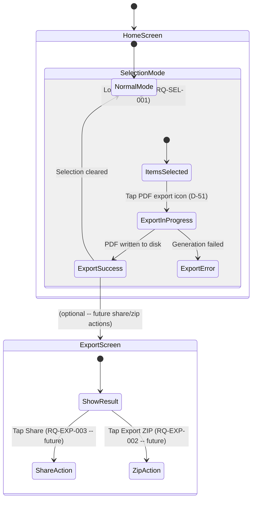
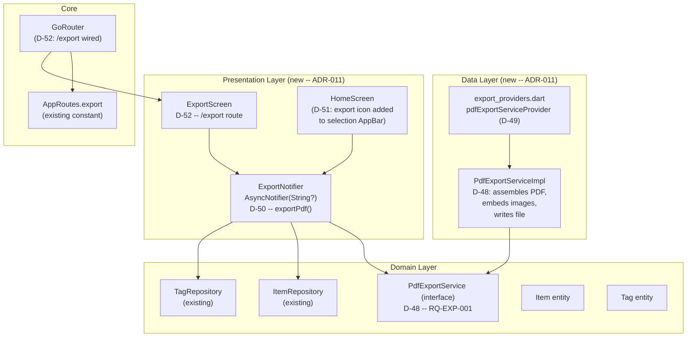

<!-- Model: Claude Sonnet 4.6 -->

# ADR-011: Export and Share

- **Status:** Accepted (RQ-EXP-001 implemented; RQ-EXP-002 and RQ-EXP-003 pending)
- **Date:** 2026-03-30
- **Deciders:** Project stakeholder, AI review
- **Requirement IDs affected:** RQ-EXP-001, RQ-EXP-002, RQ-EXP-003

---

## Context

The user needs to justify the condition of possessions to insurance providers.
The export and share features form the final delivery mechanism: a PDF report
assembles all item data into a human-readable format, a ZIP archive bundles the
PDF with all raw media files for archival, and the native OS share mechanism
dispatches the output to email or messaging apps.

Three requirements form a sequential dependency chain:

| ID | Requirement | Depends on |
|---|---|---|
| RQ-EXP-001 | Export selected items as a PDF report including photos and all properties | Selection (RQ-SEL-001/002/003) |
| RQ-EXP-002 | Export as ZIP archive containing the PDF + all associated media | RQ-EXP-001 (PDF must exist first) |
| RQ-EXP-003 | Share PDF or ZIP via native OS share mechanism | RQ-EXP-001 or RQ-EXP-002 |

The selection mechanism (multi-select on home screen) is already implemented
(ADR-007). The selected item ids are available in `SelectionState.selectedIds`.
The `AppRoutes.export = '/export'` constant is declared but the route is not yet
wired in `GoRouter`.

### Entry point into the export flow

The export feature is reached **from multi-selection mode** on the home screen.
Items are already selected when the user triggers export.

### Platform concerns

- **Windows:** `dart:io` for file writing; no `flutter_share` equivalent needed
  for the PDF-only phase (RQ-EXP-001). The PDF is written to
  `path_provider`'s `getApplicationDocumentsDirectory()`.
- **Android:** same file path strategy; native share via OS intent is required
  for RQ-EXP-003.

### Package evaluation for PDF generation

| # | Package | Evaluation | Outcome |
|---|---|---|---|
| A | **`pdf`** (pub.dev `pdf: ^3.x`) | Dart-native PDF generation; no native dependencies; extensive layout API including text, images, tables; works on all platforms without FFI | **Accepted** |
| B | **`printing`** (companion to `pdf`) | Adds print + share + preview capabilities; wraps native share/print on Android and Windows; needed for RQ-EXP-003 | **Accepted for RQ-EXP-003** |
| C | **`syncfusion_flutter_pdf`** | Feature-rich but requires a licence for commercial use | Rejected: licence cost |
| D | **Custom HTML-to-PDF via a WebView** | PDF fidelity poor on desktop; extra WebView dependency | Rejected: complexity + fidelity |

### Package evaluation for ZIP (RQ-EXP-002, future)

| # | Package | Outcome |
|---|---|---|
| A | **`archive`** (pub.dev) | Pure Dart; no native dependencies; straightforward zip creation and extraction | **Reserved for RQ-EXP-002** |
| B | **`flutter_archive`** | Flutter plugin wrapping native zlib; adds native build complexity | Rejected: unnecessary native overhead |

### Alternatives considered for export entry point

| # | Alternative | Outcome |
|---|---|---|
| A | **Export icon button in selection-mode AppBar** alongside delete and filter | **Accepted**: consistent with existing action-bar pattern (ADR-007 D-29); no extra navigation needed to trigger export |
| B | **Dedicated "Export" screen navigated from history** | Rejected: forces re-selection; breaks the natural multi-select -> export flow |
| C | **Long-tap context menu on individual items** | Rejected: does not cover multi-item selection; inconsistent with existing UX |

### PDF content design

The PDF report for RQ-EXP-001 must include:

- Cover page: app name, export date, item count
- One section per item containing:
  - Name, category, acquisition date, serial number (if present)
  - Tags (if any)
  - Custom key/value properties (if any)
  - Main photo full-width
  - Additional photos as grid thumbnails
  - Document filenames (listed; not embedded -- documents are arbitrary binary)

### State management for export

| # | Alternative | Outcome |
|---|---|---|
| A | **`ExportNotifier` as `AsyncNotifier<ExportResult?>`** -- owns progress state and the path(s) of generated file(s); selected item ids passed as a constructor parameter via `family` or loaded from `SelectionState` | **Accepted**: consistent with existing `TagManagementNotifier` / `ItemFormController` pattern |
| B | **Trigger export directly from widget** via `ref.read(pdfExportServiceProvider).export(ids)` | Rejected: no progress state, no error surfacing, untestable logic in widget layer |

---

## Decisions

### D-47: Add `pdf` and `printing` dependencies (RQ-EXP-001 / RQ-EXP-003)

**Decision:** Add to `pubspec.yaml`:

```yaml
# D-47: PDF generation (RQ-EXP-001)
pdf: ^3.11.1

# D-47: Print/share/preview companion to pdf package (RQ-EXP-003)
printing: ^5.14.1
```

`archive` is reserved for RQ-EXP-002 and added at that time.

**Consequences:**
- Both packages are pure Dart with no native dependencies on Windows.
- `printing` on Android uses platform channels for the share intent.

---

### D-48: `PdfExportService` -- domain-level interface + data-layer implementation (RQ-EXP-001)

**Decision:** A new abstract interface in the domain layer:

```dart
// lib/domain/services/pdf_export_service.dart
abstract interface class PdfExportService {
  /// Generates a PDF report for the given [items] and saves it to the app
  /// documents directory. Returns the absolute path of the written file.
  Future<String> exportToPdf(List<Item> items, List<Tag> tags);
}
```

The concrete implementation `PdfExportServiceImpl` lives in
`lib/data/services/pdf_export_service_impl.dart`. It uses the `pdf` package
to assemble the document and `path_provider` (already a dependency) to resolve
the output directory.

**File naming:** `flutins_export_<ISO8601-date>.pdf`
(e.g. `flutins_export_2026-03-30.pdf`).

**Rationale:**
- Interface in domain keeps the domain layer free of infrastructure imports.
- Implementation in data layer owns all `pdf`-package imports.
- Injecting the interface via Riverpod (D-49) enables mocking in unit tests.

**Consequences:**
- New files:
  - `lib/domain/services/pdf_export_service.dart` (interface)
  - `lib/data/services/pdf_export_service_impl.dart` (implementation)
  - `lib/data/providers/export_providers.dart` (Riverpod provider)

---

### D-49: `pdfExportServiceProvider` -- Riverpod provider (RQ-EXP-001)

**Decision:** A `keepAlive` Riverpod provider of type `PdfExportService`
in `lib/data/providers/export_providers.dart`:

```dart
@Riverpod(keepAlive: true)
PdfExportService pdfExportService(PdfExportServiceRef ref) {
  return PdfExportServiceImpl();
}
```

**Consequences:**
- `ExportNotifier` reads this provider with `ref.read(pdfExportServiceProvider)`.
- Tests override it with a mock.

---

### D-50: `ExportNotifier` -- AsyncNotifier for export operations (RQ-EXP-001 / RQ-EXP-002)

**Decision:** A `@riverpod` `AsyncNotifier<String?>` in
`lib/presentation/export/export_notifier.dart`:

State is `AsyncValue<String?>`:
- `AsyncData(null)` -- idle.
- `AsyncLoading` -- export in progress (PDF or ZIP).
- `AsyncData(filePath)` -- export completed; holds the path of the output file.
- `AsyncError` -- generation failed.

Public API:

| Method | Action |
|---|---|
| `exportPdf(List<String> itemIds)` | Loads full `Item` data from `ItemRepository`, loads tags from `TagRepository`, calls `PdfExportService.exportToPdf()`, stores path in state. |
| `exportZip(List<String> itemIds)` | Reserved for RQ-EXP-002; throws `UnimplementedError` until then. |

**Rationale:**
- Owning the state allows the UI to show a progress indicator and react to
  success / error without polling.
- Loading items inside the notifier (not inside the widget) keeps the widget
  thin and testable.

**Consequences:**
- New files: `lib/presentation/export/export_notifier.dart` + `.g.dart`.

---

### D-51: Export entry point -- icon in selection-mode AppBar (RQ-EXP-001)

**Decision:** Add an export icon (`Icons.picture_as_pdf_outlined`) as a new
action in the selection-mode AppBar of `HomeScreen`. It is only visible when
`selectionState.isActive` AND `selectionState.count > 0`.

Tap handler:
1. Reads `selectionState.selectedIds`.
2. Calls `ref.read(exportNotifierProvider.notifier).exportPdf(ids)`.
3. Watches `exportNotifierProvider` for the result:
   - Loading: show `CircularProgressIndicator` in a modal barrier or SnackBar
     with a message.
   - Success: show SnackBar with file path + optional "Share" action (RQ-EXP-003 hook).
   - Error: show SnackBar with error message.
4. On success, exits selection mode (`selectionNotifier.cancel()`).

**Rationale:**
- Placing the action in the selection AppBar is consistent with Delete (D-29).
- Calling the notifier from the AppBar keeps the export trigger co-located with
  the selection state.

**Consequences:**
- `_Strings.tooltipExport` constant added to `home_screen.dart`.
- `_buildSelectionAppBar` gains one `IconButton`.
- `HomeScreen.build` gains a `ref.listen` on `exportNotifierProvider`.

---

### D-52: `ExportScreen` -- progress and result screen (RQ-EXP-001, future: RQ-EXP-002 / RQ-EXP-003)

**Decision:** A minimal `ConsumerWidget` `ExportScreen` at
`lib/presentation/export/export_screen.dart` wired to `AppRoutes.export`
(`/export`). It is **not the primary trigger** for export (that is the AppBar
icon per D-51) but serves as a dedicated screen for:

- Showing export progress during long-running PDF/ZIP generation.
- Offering post-export actions: "Open file", "Share" (RQ-EXP-003 hook),
  "Export ZIP" (RQ-EXP-002 hook).

For RQ-EXP-001, the screen is reached via `context.push(AppRoutes.export)`
after calling `exportPdf`. The route is already declared in `AppRoutes`.

**Note:** For the initial RQ-EXP-001 implementation, the SnackBar feedback
from D-51 is sufficient. `ExportScreen` is scaffolded now to avoid a future
cross-cutting change to the router.

**Consequences:**
- New file: `lib/presentation/export/export_screen.dart`.
- `router.dart` gains the `/export` GoRoute entry (the constant already exists).

---

## Implementation Phases

### Phase 1 -- PDF generation (RQ-EXP-001)

| Step | Artifact | Description |
|---|---|---|
| 1.1 | `pubspec.yaml` | Add `pdf` and `printing` dependencies |
| 1.2 | `pdf_export_service.dart` | Domain interface (D-48) |
| 1.3 | `pdf_export_service_impl.dart` | Data implementation: document assembly, image embedding, file write |
| 1.4 | `export_providers.dart` | `pdfExportServiceProvider` (D-49) |
| 1.5 | `export_notifier.dart` | `ExportNotifier` with `exportPdf` (D-50) |
| 1.6 | `export_screen.dart` | Scaffolded screen (D-52) |
| 1.7 | `router.dart` | Wire `/export` GoRoute (D-52) |
| 1.8 | `home_screen.dart` | Add export icon to selection AppBar + `ref.listen` (D-51) |
| 1.9 | Tests | Unit tests for `PdfExportServiceImpl` and `ExportNotifier` |
| 1.10 | Verify | `flutter analyze` + `flutter test` -- 0 issues, all green |

**Requirements covered:** RQ-EXP-001

### Phase 2 -- ZIP archive (RQ-EXP-002) -- future

| Step | Artifact | Description |
|---|---|---|
| 2.1 | `pubspec.yaml` | Add `archive` dependency |
| 2.2 | `zip_export_service.dart` | Domain interface |
| 2.3 | `zip_export_service_impl.dart` | Implementation: copy PDF + media into zip |
| 2.4 | `export_providers.dart` | `zipExportServiceProvider` |
| 2.5 | `export_notifier.dart` | Implement `exportZip()` method |
| 2.6 | `export_screen.dart` | Add "Export ZIP" action |
| 2.7 | Tests | Unit tests for `ZipExportServiceImpl` and `exportZip` |

### Phase 3 -- Native share (RQ-EXP-003) -- future

| Step | Artifact | Description |
|---|---|---|
| 3.1 | `export_screen.dart` | Add "Share" action calling `Printing.sharePdf()` (for PDF) or the `Share` plugin (for ZIP) |
| 3.2 | Tests | Platform-channel mock tests |

---

## Consequences Summary

| Decision | Risk | Mitigation |
|---|---|---|
| D-47: `pdf` package | Large document with many images may be slow | Images resized before embedding (200px max width per photo in grid) |
| D-48: Domain interface | Extra indirection | Enables complete unit testing without file I/O |
| D-50: Notifier loads items | N items loaded at export time, not from selection screen state | Acceptable: export is an infrequent, user-initiated operation |
| D-51: AppBar icon | AppBar may become crowded (delete + filter + export) | Three icons is within standard Material AppBar capacity |
| D-52: Route scaffolded now | Unused screen adds small code weight | Minimal; consolidates all router changes in one phase |

---

## Interaction Flow




