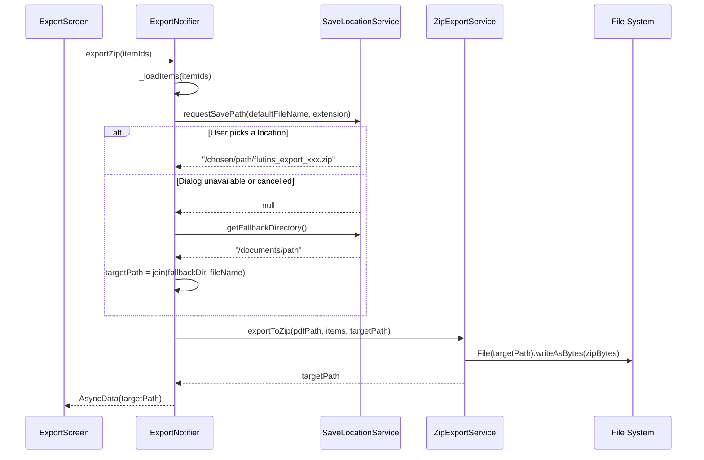
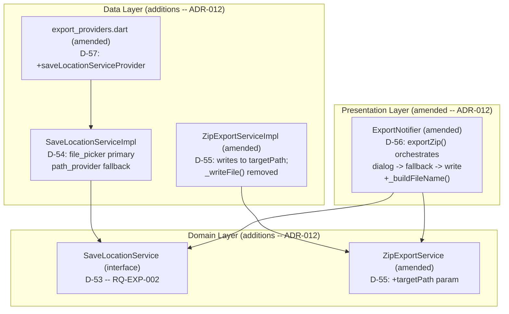

<!-- Model: Claude Sonnet 4.6 -->

# ADR-012: ZIP Save Location -- Native File Dialog and Fallback Strategy (RQ-EXP-002)

## Status

Proposed

---

## Context

RQ-EXP-002 was amended after ADR-011 was written and partially implemented.
The original requirement stated only that the application should produce a ZIP
archive. The amended requirement adds:

> "The application shall ask the user via the operating system file manager a
> location where to store the archive. If not possible, the archive shall be
> saved into the user's document folder or home folder depending on the
> capabilities of the operating system."

This amendment introduces two new concerns that were not addressed in ADR-011:

1. **A native save-file dialog** must be shown to the user before writing the
   archive, so the user controls the destination path.
2. **A graceful fallback** must handle platforms or situations where the dialog
   is unavailable (e.g., user cancels, platform API not supported, restricted
   storage permissions on older Android).

### Impact on the existing ADR-011 implementation

ADR-011 Phase 2 (D-47, D-50, and `ZipExportServiceImpl`) was implemented with
a fixed output path resolved via `path_provider.getApplicationDocumentsDirectory()`.
That strategy is now insufficient: the implementation writes the archive without
ever interacting with the user about the destination.

The following existing artifacts are directly affected:

| Artifact | Current behaviour | Required change |
|---|---|---|
| `ZipExportService.exportToZip()` | Internal `_writeFile()` resolves path silently | Must accept an explicit `targetPath` parameter |
| `ZipExportServiceImpl._writeFile()` | Always writes to `getApplicationDocumentsDirectory()` | Removed; path is now provided by the caller |
| `ExportNotifier.exportZip()` | Calls service directly; no user interaction | Must obtain a user-chosen (or fallback) path prior to calling the service |

### Platform capabilities

| Platform | Native save dialog API | Availability |
|---|---|---|
| Windows | Win32 `GetSaveFileName` / COM `IFileSaveDialog` | Always available |
| Android >= 11 (API 30) | Storage Access Framework `ACTION_CREATE_DOCUMENT` | Always available |
| Android < 11 | `ACTION_CREATE_DOCUMENT` available from API 19, but behaviour may vary | Treat as "may return null; apply fallback" |

### Package evaluation for save dialog

`file_picker ^8.1.6` is already declared in `pubspec.yaml` (added in ADR-011 Phase 1).

| # | Option | Evaluation | Outcome |
|---|---|---|---|
| A | **`file_picker.FilePicker.platform.saveFile()`** | Pure platform-channel; no CMake native build; covers Windows and Android via SAF; already a declared dependency; returns `String?` (null when unavailable or cancelled) | **Accepted** |
| B | **`file_selector` (Flutter team)** | Official Flutter team package; good Windows/macOS/Linux support; Android support is limited and not on stable as of 2026-03-31 | Rejected: incomplete Android support |
| C | **Custom platform channel** | Full control but significant maintenance burden | Rejected: unnecessary given option A |

### Fallback path strategy

When `FilePicker.platform.saveFile()` returns `null` (user cancelled or API
unavailable), the fallback priority is:

1. `path_provider.getApplicationDocumentsDirectory()` -- available on both
   Windows (Documents folder) and Android (app-specific external storage or
   internal documents).
2. `path_provider.getDownloadsDirectory()` -- Windows only; used if the
   documents directory call throws (should not occur in practice).
3. System temporary directory (`path_provider.getTemporaryDirectory()`) --
   last resort; guarantees a writable path on any supported platform.

### Architectural placement of save-path selection

The save-file dialog is a platform I/O interaction, not a visual widget.
Two placements were considered:

| # | Option | Evaluation | Outcome |
|---|---|---|---|
| A | **New `SaveLocationService` domain interface + data-layer impl** injected into `ExportNotifier`; `ZipExportService` receives explicit `targetPath` | Preserves single-responsibility; `ZipExportService` stays a pure zip-writer; `SaveLocationService` is independently testable and mockable | **Accepted** |
| B | Inject `file_picker` directly into `ZipExportServiceImpl` | Couples infrastructure (file picker) to the data service; harder to test; violates D of SOLID | Rejected |
| C | Call `file_picker` directly from the widget layer | Business logic in UI; untestable | Rejected |

---

## Decisions

### D-53: `SaveLocationService` -- domain interface for user-driven save-path selection (RQ-EXP-002)

**Decision:** Introduce a new abstraction in the domain layer:

```dart
// lib/domain/services/save_location_service.dart
abstract interface class SaveLocationService {
  /// Shows the native OS save-file dialog pre-populated with [defaultFileName]
  /// and filtered to [extension] (e.g. 'zip').
  /// Returns the user-chosen absolute path, or null if the dialog is
  /// unavailable or the user cancels.
  Future<String?> requestSavePath({
    required String defaultFileName,
    required String extension,
  });

  /// Returns a guaranteed-writable fallback directory path when no dialog
  /// path is available (documents folder, then downloads, then temp).
  Future<String> getFallbackDirectory();
}
```

**Rationale:**
- Keeps `ZipExportService` free of UI or file-picker imports.
- The interface is mockable: unit tests for `ExportNotifier.exportZip()` can
  inject a `FakeSaveLocationService` returning a predetermined path without
  touching the real file system or showing a dialog.

**New files:**
- `lib/domain/services/save_location_service.dart` (interface)
- `lib/data/services/save_location_service_impl.dart` (implementation)

---

### D-54: `SaveLocationServiceImpl` -- `file_picker` primary, `path_provider` fallback (RQ-EXP-002)

**Decision:** The concrete implementation calls
`FilePicker.platform.saveFile()` first; if that returns `null`, it falls
back through the priority chain described in the Context section.

```
requestSavePath():
  1. path = await FilePicker.platform.saveFile(
       dialogTitle: title,
       fileName: defaultFileName,
       type: FileType.custom,
       allowedExtensions: ['zip'],
     )
  2. return path  -- may be null

getFallbackDirectory():
  1. try getApplicationDocumentsDirectory()  -> return .path
  2. catch -> try getDownloadsDirectory()    -> return .path
  3. catch -> return getTemporaryDirectory() -> return .path
```

**Rationale:**
- `file_picker` is already a declared dependency; no new pubspec entry needed.
- The three-level fallback guarantees that `getFallbackDirectory()` never
  throws, satisfying the "shall be saved into the user's document folder or
  home folder" clause of RQ-EXP-002.

---

### D-55: `ZipExportService` interface -- explicit `targetPath` parameter (RQ-EXP-002)

**Decision:** Amend the domain interface signature to accept the pre-resolved
output path:

```dart
// Before (ADR-011):
Future<String> exportToZip(String pdfPath, List<Item> items);

// After (ADR-012):
Future<String> exportToZip(String pdfPath, List<Item> items, String targetPath);
```

`ZipExportServiceImpl` removes `_writeFile()` entirely; it now writes directly
to `targetPath` using `dart:io File(targetPath).writeAsBytes(zipBytes)`.

**Rationale:**
- The service is a pure ZIP assembler with no knowledge of where the output
  goes. The path is established upstream by the orchestrator (`ExportNotifier`).
- This change is backward-compatible at the logic level; only the call sites in
  `ExportNotifier` and the unit tests need updating.

---

### D-56: `ExportNotifier.exportZip()` -- orchestrate dialog -> fallback -> write (RQ-EXP-002)

**Decision:** Rewrite `exportZip()` to follow a three-step sequence:

```
exportZip(itemIds):
  1. items  = await _loadItems(itemIds)
  2. svc    = ref.read(saveLocationServiceProvider)
  3. fileName = _buildFileName(now)                  // e.g. flutins_export_2026-03-31_130000.zip
  4. chosen = await svc.requestSavePath(
               defaultFileName: fileName, extension: 'zip')
  5. if chosen == null:
       fallbackDir = await svc.getFallbackDirectory()
       targetPath  = join(fallbackDir, fileName)
     else:
       targetPath  = chosen
  6. zipSvc = ref.read(zipExportServiceProvider)
  7. return zipSvc.exportToZip(_lastPdfPath!, items, targetPath)
```

**Rationale:**
- The notifier is already the orchestration layer for export operations
  (ADR-011 D-50). Placing path resolution here keeps both the domain interface
  and the service implementation free of dialog/UX concerns.
- Constructing the default file name in the notifier ensures consistency between
  the name pre-populated in the dialog and the fallback name used when no dialog
  is shown.

**Consequences:**
- `ExportNotifier` gains a dependency on `saveLocationServiceProvider`.
- `_buildFileName()` private helper is added to `ExportNotifier`.

---

### D-57: `saveLocationServiceProvider` -- Riverpod provider (RQ-EXP-002)

**Decision:** Add to `lib/data/providers/export_providers.dart`:

```dart
@Riverpod(keepAlive: true)
SaveLocationService saveLocationService(SaveLocationServiceRef ref) {
  return SaveLocationServiceImpl();
}
```

**Consequences:**
- Test overrides inject `FakeSaveLocationService` via
  `ProviderContainer(overrides: [...])`.
- No additional pubspec entry required.

---

## Implementation Phases

### Phase 4 -- ZIP save-location dialog (RQ-EXP-002 amendment)

| Step | Artifact | Description |
|---|---|---|
| 4.1 | `save_location_service.dart` | New domain interface (D-53) |
| 4.2 | `save_location_service_impl.dart` | `file_picker` + `path_provider` fallback (D-54) |
| 4.3 | `export_providers.dart` | Add `saveLocationServiceProvider` (D-57) |
| 4.4 | `zip_export_service.dart` | Add `targetPath` parameter to interface (D-55) |
| 4.5 | `zip_export_service_impl.dart` | Remove `_writeFile()`; write directly to `targetPath` (D-55) |
| 4.6 | `export_notifier.dart` | Rewrite `exportZip()` with dialog + fallback orchestration; add `_buildFileName()` (D-56) |
| 4.7 | Tests | Update `exportZip` unit tests; add tests for `SaveLocationServiceImpl` fallback chain; add `FakeSaveLocationService` test helper |
| 4.8 | Verify | `flutter analyze` -- 0 issues; `flutter test` -- all green |

**Requirements covered:** RQ-EXP-002 (amended clause)

---

## Consequences

| Decision | Risk | Mitigation |
|---|---|---|
| D-53: New interface | Extra indirection layer | Enables full unit testing without dialog UI or real file system |
| D-54: `file_picker.saveFile()` on Android | Returns null on a device with no SAF support | Fallback chain guarantees a writable path is always used |
| D-55: Interface signature change | Breaks existing call site in `ExportNotifier` | Only one call site; updated in Step 4.6 |
| D-56: Notifier orchestrates dialog + write | If user cancels (null path), fallback is silent | RQ-EXP-002 explicitly permits silent fallback; no additional UX required |
| D-57: keepAlive provider | Provider stays alive for app lifetime | Low cost; consistent with existing `pdfExportServiceProvider` (D-49) |

---

## Updated Interaction Flow




