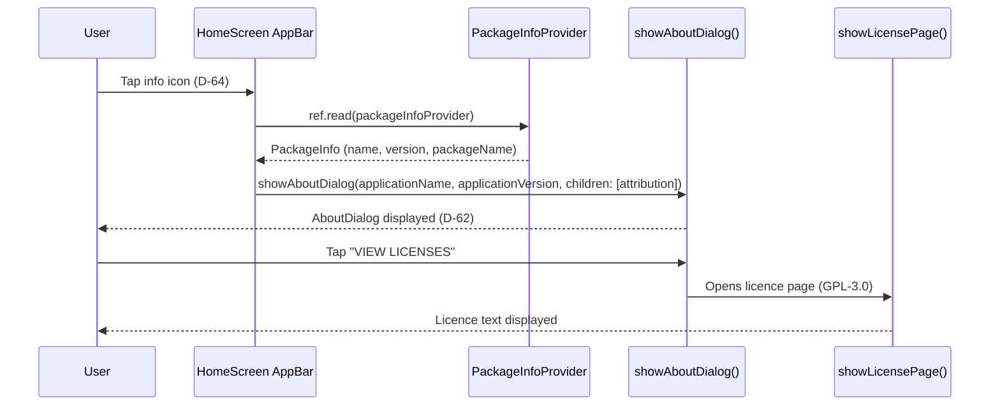

<!-- Model: Claude Opus 4.6 -->
# ADR-014: About Dialog -- Built-in Flutter AboutDialog with package_info_plus

## Status

Proposed

## Requirement Traceability

| Requirement | Description |
|-------------|-------------|
| RQ-ABT-001  | About dialog showing app name, package ID, version, author, licence, and AI-generation attribution |

## Context

RQ-ABT-001 requires an "About" dialog accessible from the main screen that displays
the application name, package identifier, version number, author name, licence, and a
statement that the application was entirely generated by AI following a reproducible,
human-defined engineering process.

The dialog must:

1. Show accurate runtime metadata (version, package ID) without hardcoding duplicates.
2. Respect the existing Material 3 theme (ADR-013 / D-58--D-61).
3. Be accessible from the home screen AppBar without adding a new route.
4. Display the GPL-3.0 licence text via the standard Flutter licence viewer.

Flutter provides a built-in `showAboutDialog()` function and `AboutDialog` widget that
render a Material-styled dialog with application icon, name, version, and a link to the
licence page (`showLicensePage`). This avoids building a custom dialog from scratch.

The application version is defined in `pubspec.yaml` (`version: 1.0.0+1`). Reading it
at runtime requires a platform channel. The `package_info_plus` package is the standard
Flutter community solution for this, with zero native configuration on Windows and
Android.

## Decision

### D-62: Use Flutter's built-in `showAboutDialog()`

The About dialog will use `showAboutDialog()` which renders a Material 3 `AboutDialog`.
This provides:

- Application name, version, and icon display
- `children` parameter for the AI-generation attribution widget
- A "VIEW LICENSES" button that opens `showLicensePage` (GPL-3.0 text included
  automatically via `LicenseRegistry`)

No custom dialog widget or new route is needed.

### D-63: Add `package_info_plus` for runtime metadata

Add `package_info_plus` as a dependency to retrieve `appName`, `packageName`, `version`,
and `buildNumber` at runtime from the platform. This avoids duplicating the version
string from `pubspec.yaml` as a hardcoded constant.

A Riverpod `FutureProvider` will expose `PackageInfo` to the widget tree.

### D-64: Home screen AppBar info button as entry point

Add an `IconButton` with `Icons.info_outline` to the default (non-selection) AppBar
actions in `HomeScreen`. Pressing it calls `showAboutDialog()`. This keeps the entry
point discoverable without adding navigation complexity.

The icon will appear after the existing tag-management button.

### D-65: About dialog string constants

All string literals for the About dialog (author name, AI attribution message, tooltip)
will be declared as named constants in a private `_Strings` class local to the home
screen file to follow the project's no-duplicated-literals rule.

## Consequences

### Easier

- Minimal implementation: `showAboutDialog()` handles layout, theming, and licence
  viewing out of the box.
- Version stays in sync with `pubspec.yaml` automatically via `package_info_plus`.
- No new route, no new screen file -- just a dialog invocation.
- The "View licenses" page aggregates all transitive package licences automatically,
  which is more complete and legally thorough than showing only the app licence.

### Harder

- Adding `package_info_plus` introduces one new dependency (though it is a well-maintained
  Flutter Favorite package with no transitive native dependencies on Windows/Android).

### Constrained

- The dialog layout follows Material guidelines. Deep visual customisation would require
  replacing `showAboutDialog` with a fully custom dialog in the future.
- The "View licenses" page shows licences for all transitive dependencies, not only the
  app's own GPL-3.0 licence. This is an accepted and legally correct behaviour of
  Flutter's built-in `LicenseRegistry`.

## Diagram

