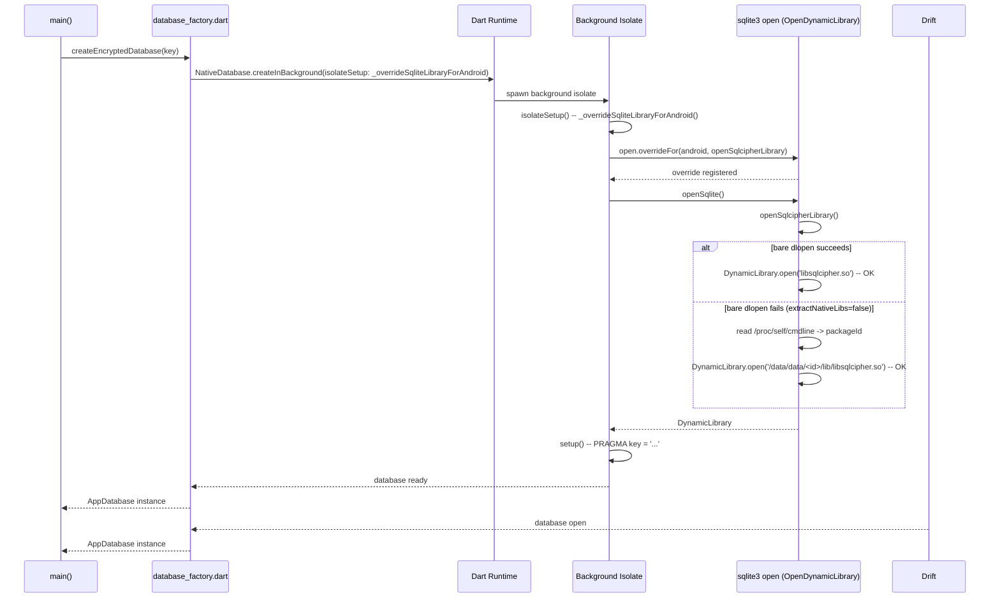

<!-- Generated by: Claude Sonnet 4.6 -->
# ADR-015: Android SQLCipher Dynamic Library Workaround

## Status
Accepted -- 2026-04-01

## Context

**Requirement IDs:** RQ-DAT-002, RQ-NFR-001

### Observed failure

When the application is launched on Android (release build produced by
`flutter build apk --release`), it crashes immediately at startup with:

```
Failed to load dynamic library '/data/data/com.spashx.flutins/lib/libsqlite3.so':
dlopen failed: library "/data/data/com.spashx.flutins/lib/libsqlite3.so" not found
```

The crash occurs inside `database_factory.dart` at the point where
`NativeDatabase.createInBackground` initialises the SQLite FFI binding.

### Root cause analysis

Two compounding issues caused the startup crash:

#### Issue 1 -- isolate boundary (first observed error: `libsqlite3.so not found`)

```
Drift (NativeDatabase.createInBackground)
  --> spawns a background Dart isolate
    --> sqlite3 Dart package (FFI bindings) inside that isolate
      --> dlopen("libsqlite3.so")  <-- default, looks for THIS name
          NOT FOUND: sqlcipher_flutter_libs ships "libsqlcipher.so"
```

Dart isolates do **not** share global memory. Any `open.overrideFor()` call in
the main isolate is invisible to the background isolate. The fix is to pass the
override as `isolateSetup` to `createInBackground`, which runs the callback
**inside** the background isolate before the database is opened.

#### Issue 2 -- bare dlopen fails on some Android versions (second error: `libsqlcipher.so not found`)

Once Issue 1 was fixed, the background isolate correctly attempted
`dlopen("libsqlcipher.so")`. On Android devices where `extractNativeLibs=false`
(the default for release builds targeting API 23+), native libraries are **not**
extracted to the filesystem; they remain compressed inside the APK. Bare
`dlopen("name.so")` only searches the system linker namespace and the app's
native library directory -- when the library is not extracted, it is not found.

The solution is to fall back to the full absolute path by reading the package ID
from `/proc/self/cmdline` and constructing
`/data/data/<packageId>/lib/libsqlcipher.so`. This is the same pattern used by
`package:sqlite3` itself for `libsqlite3.so`.

#### Note: `applyWorkaroundToOpenSqlite3OnOldAndroidVersions()` no longer exists

Earlier versions of `sqlcipher_flutter_libs` (<=0.6.x) shipped a helper
function that bundled both fixes above. As of v0.7.0, `sqlcipher_flutter_libs`
is a **tombstone package** -- its library file is empty and the function is
gone. The correct API is now `open.overrideFor()` from `package:sqlite3/open.dart`.

### Why the omission was not caught earlier

- All automated tests (unit and widget) run against the `sqlite3_flutter_libs`
  test stub on the Flutter test host (Windows), which does not exercise the
  Android native-library resolution path.
- The release APK was the first time the code ran on an actual Android device.

## Decision

**D-15-1: Pass `open.overrideFor()` as the `isolateSetup` callback of
`NativeDatabase.createInBackground`, not as a call in the main isolate.**

Drift's `createInBackground` accepts an `isolateSetup` parameter -- a
callback that runs inside the spawned background isolate **before** the
database is opened. Because the override must be in effect within the same
isolate that calls `dlopen`, this is the only correct place to put it.

The callback must be a **top-level or static function** (not a closure) so
that Dart can serialise it for cross-isolate transfer.

```dart
import 'dart:ffi';
import 'dart:io';
import 'package:sqlite3/open.dart';

// Top-level -- required for isolate sendability.
void _overrideSqliteLibraryForAndroid() {
  open.overrideFor(
    OperatingSystem.android,
    () => DynamicLibrary.open('libsqlcipher.so'),
  );
}

Future<AppDatabase> createEncryptedDatabase(String encryptionKey) async {
  final docsDir = await getApplicationDocumentsDirectory();
  final dbFile = File(p.join(docsDir.path, AppDatabaseConstants.databaseFileName));

  return AppDatabase(
    NativeDatabase.createInBackground(
      dbFile,
      isolateSetup: Platform.isAndroid ? _overrideSqliteLibraryForAndroid : null,
      setup: (rawDatabase) {
        rawDatabase.execute("PRAGMA key = '\$encryptionKey'");
      },
    ),
  );
}
```

No changes to `pubspec.yaml` are required: `sqlite3` is a transitive dependency
already present in the graph via `drift`.

## Consequences

### Positive
- The app launches successfully on Android and the encrypted database is opened
  correctly via SQLCipher.
- The Windows code path is unaffected; no regression risk on the desktop target.
- No new dependencies are needed.

### Constraints introduced
- `openSqlcipherLibrary` and `_overrideSqliteLibraryForAndroid` must remain
  top-level functions (not closures) for Dart isolate sendability.
- If a second database factory is added for Android it must pass the same
  `isolateSetup` callback.
- `open.overrideFor` is a global setter inside the background isolate;
  calling it more than once per isolate is harmless but redundant.

### Testing

Two unit tests in `test/data/database/database_factory_test.dart` (RQ-DAT-002):

1. **Given** non-Android host, **When** `openSqlcipherLibrary()` is called, **Then** `ArgumentError` is thrown -- the `!Platform.isAndroid` rethrow branch fires.
2. **Given** non-Android host, **When** `openSqlcipherLibrary()` throws, **Then** the error is `ArgumentError` (not `FileSystemException`), proving the `/proc/self/cmdline` fallback was NOT entered.

### Verification
Rebuild with `flutter build apk --release`, install on an Android device, and
confirm the app starts without a `dlopen` crash and the database is accessible.

## Diagram


