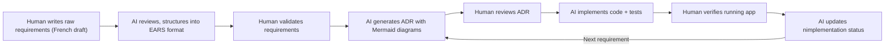

# Flutins

**Asset inventory application for insurance justification.**

Built entirely by AI (Claude Opus 4.6) following a reproducible, human-defined engineering process -- demonstrating that deterministic results are achievable with Software Generative AI.

| | |
|---|---|
| **Platforms** | Windows, Android |
| **Framework** | Flutter 3.x / Dart 3.11 |
| **Architecture** | Domain-driven, 3-layer (Domain / Data / Presentation) |
| **State Management** | Riverpod with code generation |
| **Database** | Drift ORM + SQLCipher (AES-256 encryption) |
| **Tests** | 138 unit and widget tests, all green |
| **ADRs** | 14 Architecture Decision Records, 65 tracked decisions |

---

## 1. The Process

### 1.1 How It Worked

The entire application was built through a structured human-AI collaboration loop. The human defined the rules, reviewed every decision, and steered direction. The AI executed implementation, authored tests, and maintained traceability. No code was written by hand.



### 1.2 Step by Step

1. **Requirements draft** -- The human wrote a one-page specification in French (`top-level-requirements.draft.md`) describing the desired application.

2. **AI review** -- Following the engineering rules in `copilot-instructions.md`, the AI translated, restructured, and expanded the draft into 35 formal requirements in EARS format (`top-level-requirements-ai-reviewed.md`), assigning unique IDs (`RQ-<FTR>-<NNN>`). Gaps were identified and filled (search bar, multi-selection cancel, media edit mode, export/share).

3. **ADR-001: Baseline** -- The AI produced the first Architecture Decision Record resolving five ambiguities (encryption strategy, custom property scope, export capability, camera detection, tag cascade). The human reviewed and accepted it.

4. **Iterative implementation loop** -- This cycle was applied to all 35 requirements, following a logical implementation order: infrastructure first (scaffold, database, encryption), then domain entities and repositories, then UI screens (create, edit, list), then cross-cutting features (multi-selection, search, media, tags), and finally export/share and polish (theme, about dialog). The full implementation order with dates is tracked in `1_requirements/top-level-requirements-ai-reviewed-implementation-status.md`. For each feature:
   - The AI generated an ADR with numbered decisions (`D-01` through `D-65`) and Mermaid diagrams.
   - The human reviewed the ADR.
   - The AI implemented: domain interfaces, data layer, providers, presentation widgets, and tests -- all referencing requirement IDs in file headers, doc comments, and test names.
   - `flutter analyze` (0 issues) and `flutter test` (all green) were run after every step.
   - The implementation status table was updated.

5. **Traceability enforced at every layer** -- Every source file, test, and ADR references the requirement ID(s) it fulfills. No artifact exists without a traceable origin.

### 1.3 Engineering Rules Followed

The `copilot-instructions.md` file defined the rules the AI followed throughout:

| Rule | How it was applied |
|---|---|
| **Plan before acting** | Todo lists created and tracked for every task |
| **Read before editing** | Every file read in-session before modification |
| **Verify after each step** | `flutter analyze` + `flutter test` after every change |
| **EARS requirements** | All 35 requirements written in EARS format |
| **Unique IDs** | `RQ-<FTR>-<NNN>` on every requirement |
| **ADR per cross-cutting decision** | 14 ADRs produced, each with Mermaid diagrams |
| **Gherkin tests** | All tests use Given/When/Then naming |
| **No duplicated literals** | Named constants in `_Strings` and `AppConstants` classes |
| **SOLID principles** | Domain interfaces, dependency inversion via Riverpod |
| **Error recovery protocol** | Root-cause analysis, one fix attempt, then stop and report |
| **Task tiers (S/M/L)** | Every task tiered before starting |

### 1.4 Requirements -- ADR Traceability Matrix

| Requirement | Description | ADR(s) |
|---|---|---|
| RQ-NFR-001 | Flutter app targeting Windows and Android | ADR-002 |
| RQ-DAT-001 | Local SQLite3 database via Drift ORM | ADR-003 |
| RQ-DAT-002 | Encrypted database (SQLCipher) | ADR-003 |
| RQ-SEC-001 | OS-keystore encryption key | ADR-003 |
| RQ-OBJ-001 | Item entity with properties | ADR-004 |
| RQ-OBJ-002 | Item-tag association | ADR-004 |
| RQ-OBJ-003 | Per-item custom key/value properties | ADR-004 |
| RQ-OBJ-004 | Prevent deletion of mandatory properties | ADR-004 |
| RQ-OBJ-005 | Create new item | ADR-005 |
| RQ-OBJ-006 | Require mandatory properties before save | ADR-005 |
| RQ-OBJ-007 | Insert item at sort-order position | ADR-005 |
| RQ-OBJ-008 | Associate tag during create/edit | ADR-005 |
| RQ-OBJ-009 | Edit screen on item tap | ADR-006 |
| RQ-OBJ-010 | Delete selected items | ADR-004, ADR-007 |
| RQ-OBJ-011 | Deletion confirmation dialog | ADR-007 |
| RQ-SCR-001 | Main screen item list | ADR-005 |
| RQ-SCR-002 | Sort by any property | ADR-005 |
| RQ-SCR-003 | Default sort: name ascending | ADR-005 |
| RQ-SCR-004 | Text search across all properties | ADR-008 |
| RQ-SEL-001 | Long-press enters multi-selection | ADR-007 |
| RQ-SEL-002 | Cancel exits multi-selection | ADR-007 |
| RQ-SEL-003 | Filter-based bulk selection | ADR-007 |
| RQ-MED-001 | Add photo via camera or file system | ADR-009 |
| RQ-MED-002 | Hide camera when not detected | ADR-009 |
| RQ-MED-003 | Add document via file system | ADR-009 |
| RQ-MED-004 | Media gallery edit mode | ADR-009 |
| RQ-TAG-001 | Tag management screen | ADR-010 |
| RQ-TAG-002 | Full CRUD on tags | ADR-004, ADR-010 |
| RQ-TAG-003 | Show affected item count | ADR-004, ADR-010 |
| RQ-TAG-004 | Tag deletion cascades | ADR-003 |
| RQ-EXP-001 | Export as PDF report | ADR-011 |
| RQ-EXP-002 | Export as ZIP with file dialog | ADR-011, ADR-012 |
| RQ-EXP-003 | Share via native OS mechanism | ADR-011 |
| RQ-NFR-002 | Professional Material 3 UI | ADR-013 |
| RQ-ABT-001 | About dialog with AI attribution | ADR-014 |

---

## 2. Application Features

### Item Management
- Create, edit, and delete inventory items with mandatory properties (name, category, acquisition date, main photo) and optional ones (serial number, additional photos, documents).
- Per-item custom key/value properties for flexible metadata.
- Reusable tags associable to any item.

### Main Screen
- Scrollable item list with photo thumbnails and names.
- Sortable by any property (ascending/descending), defaulting to name A-Z.
- Real-time text search filtering across all item properties and tag names.

### Multi-Selection and Batch Operations
- Long-press to enter multi-selection mode.
- Filter-based bulk selection (e.g., "select all items with tag X").
- Batch deletion with confirmation dialog showing affected count.

### Media Management
- Add photos via device camera or file picker.
- Add documents via file picker only.
- Camera option hidden at runtime when no camera is detected (Windows support).
- In-gallery edit mode with checkboxes for selective media deletion.

### Tag Management
- Dedicated tag management screen with full CRUD.
- Affected item count shown before modifying or deleting a tag.
- Cascade deletion silently removes tag from all referencing items.

### Export and Sharing
- Export selected items as a PDF report (photos + all properties).
- Export as ZIP archive (PDF + all media files) with native OS file save dialog.
- Fallback to documents/downloads/temp directory when dialog is unavailable.
- Share PDF or ZIP via native OS share mechanism (email, messaging, etc.).

### Security
- SQLCipher AES-256 page-level database encryption.
- Encryption key generated per-device, stored in OS keystore (Android Keystore / Windows DPAPI).
- Transparent to the user -- no authentication screen at launch.

### User Interface
- Material Design 3 with cohesive blue color scheme.
- Light and dark mode adapting to OS preference.
- Consistent 12dp rounded corners, styled buttons, cards, inputs, dialogs, and snackbars.
- About dialog showing app name, version, author, licence, and AI-generation attribution.

---

## 3. Reflections

### What the AI Thinks of This Experience

Working through 35 requirements across 14 ADRs with strict traceability was unlike typical AI code generation. Here are honest observations:

**Traceability changed everything.** Every file header, every test name, every ADR body references a requirement ID. This felt constraining at first -- it slows down initial output. But the payoff was significant: when a test failed or a design question arose, I could trace backwards instantly from code to requirement to decision. There was never a moment of "why does this code exist?" Every line had a documented reason.

**The ADR-first workflow prevented drift.** By writing an ADR before touching code, each implementation had a clear scope, numbered decisions, and a diagram to follow. This eliminated the temptation to over-engineer or add unrequested features. The human review step between ADR and implementation caught misunderstandings early -- before any code was written.

**The iterative loop was genuinely productive.** The cycle of "requirement -> ADR -> human review -> implement -> verify -> update status" created a rhythm. Each iteration built on the previous one's foundation. By ADR-005, the patterns (domain interface -> data implementation -> provider -> presentation -> test) were established and repeatable.

**Named constants enforcement improved code quality.** The "no duplicated literals" rule forced every string and number into a `_Strings` or `AppConstants` class. This made refactoring straightforward and eliminated the class of bugs where a typo in one location doesn't match another.

**Honest friction points:**
- **Test debugging was the hardest part.** The Drift stream timer issue in the About dialog tests required three attempts and a complete approach change (from teardown hacks to eliminating the DB dependency entirely). The error recovery protocol's "stop after one failed retry" rule was tested here -- I should have recognized the root cause (Drift streams) faster instead of trying workarounds.
- **The Gherkin test naming convention produces verbose test names.** They read well in reports but are cumbersome in the IDE. A shorter Given/When/Then format or test IDs might be more practical.
- **Barrel exports required manual updates.** Every new file needed a corresponding export line in `domain.dart` or `data.dart`. This is error-prone and could be automated.

**What could be improved next time:**
1. **Automate barrel exports** -- use a code generator or convention-based auto-export.
2. **Widget test patterns for Drift** -- establish an upfront pattern for widget tests that avoids live DB streams (the fake-override approach used in the About dialog tests should be the default).
3. **ADR templates as code** -- the ADR structure could be a Dart/Mustache template generating the markdown, reducing formatting inconsistencies.
4. **Requirement dependency graph** -- a formal dependency map between requirements would have made implementation ordering more explicit (e.g., RQ-EXP-002 depends on RQ-EXP-001 which depends on RQ-OBJ-001).
5. **Performance testing** -- all current tests verify correctness. None verify performance under load (e.g., 1000 items with photos). This would be a natural next step.

**Final thought:** This project demonstrates that an AI can follow a disciplined engineering process and produce production-grade code -- but only when the process itself is explicitly defined and enforced by the human. The `copilot-instructions.md` file was the real product. The code was the output.

---

## 4. The Prompt That Generated This README

```
OK. The application seems complete. Congratulation. We demonstrate that following our process gives deterministic results. Now update the readme.md. 
1) First describe our process loop (I wrote the #file:top-level-requirements.draft.md , then we reviewed it following #file:copilot-instructions.md , you updated the requirements to #file:top-level-requirements-ai-reviewed.md and generated the first ADR. I revied the ADR-001. The we started with the first requirements, you generated the next ADR, I reviewed it, you implemented it, updated the #file:top-level-requirements-ai-reviewed-implementation-status.md , and so on.). describe how you followed the process into #file:copilot-instructions.md . add some diagram and keep a concise formulation. Add a table matrix with requirements and ADR. 
2) Then provide a summary of the features of the application we made together. 
3) finally give your thoughts of our whole experience, how you feel by using tracability everywhere during the implementation and what could be improved next time. Be honest in your feedback. 
4) Put the exact verbatim of this prompt at the end of the readme as code extract.
```

